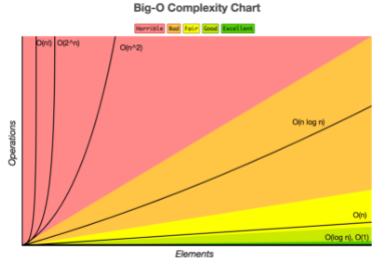

# 빅오표기법

## 알고리즘에서 중요한 속성

1. 정확성 : 주어진 입력을 모두 처리하며 올바르게 출력해야한다.
2. 효율성 : 문제를 효율적으로 해결해야한다. 두 가지 변수로 측정
   1. 시간 복잡도 : 알고리즘이 얼마나 빠르게 결과를 출력하는지 측정, 입력 크기 n에 대한 시간 함수 T(n)으로 표현
   2. 공간 복잡도 : 원하는 결과를 얻기위해 알고리즘이 얼마나 메모리를 사용하는지 측정, 입력 크기 n에 대한 메모리 사용함수 S(n)으로 표현

## 빅오 표기법(Big-O)
Big-O notation은 알고리즘의 시간 복잡도를 나타내는 표기법이며, `O(f(n))`으로 나타냄</br>

빅오를 표시할 경우 worst-case를 가정함</br>
즉, 가장 오래걸릴 경우의 시간 복잡도를 표기</br>

**최고차항의 차수**로 표현하고 계수와 낮은 차수의 항은 무시한다.</br>
ex) n^2 + n = `O(n^2)`</br>



## 시간 복잡도

### 1. 상수시간 O(1)
입력 크기 상관없이 고정된 시간으로 계산한다면 알고리즘이 상수시간(constant time)에 실행된다고 한다.</br>

- 배열의 n번째 원소에 접근
- 스택에 push/pop
- 큐에 삽입/삭제
- 해시 테이블의 원소에 접근

### 2. 선형 시간 O(n)
알고리즘의 실행 시간이 입력 크기에 정비례
- 배열에서 검색, 최솟/최댓값 찾기 등 연산
- 연결 리스트에서 순회, 최솟/최댓값 찾기 등 연산

### 3. 로그 시간 O(logn)
알고리즘의 실행 시간이 입력크기의 로그에 비례
- 이진 탐색 알고리즘

### 4. N 로그 N 시간 O(nlogn)
알고리즘의 실행 시간이 입력 크기와 입력크기의 로그 곱에 비례
- 병합 정렬(merge sort)
- 퀵 정렬(quick sort) - 평균적인 선능, 최악은 `O(n^2)`
- 힙 정렬(heap sort)

### 5. 이차 시간 O(n^2)
알고리즘의 실행 시간이 입력 크기의 제곱에 비례
- 버블 정렬(bubble sort)
- 선택 정렬(selectrion sort)
- 삽입 정렬(insertion sort)

### 지수 시간 O(2^n)
입력 데이터들의 원소들로만 만들 수 있는 모든 부분 집합을 생성

### 계승 시간 O(n!)
입력 데이터의 원소들로 만들 수 있는 모든 순열을 생성

## 알고리즘 속 함수 실행 시간 도출
- 반복문 : `O(n)`
- 중첩 반복문 : `O(n^c)` c는 중첩반목분 수
- if-else 구문 : if나 else중 실행 시간이 더 큰 블록으로 계산
- 로그 구문 : 각 반복마다 일정 크기가 일정하게 감소 `O(logn)`

## 시간 복잡도 예제
```
int sum2(int N){
    sum = 0;

    for (int i=1; i<=N; i++) {
        sum = sum + N;
    }    

    return sum;
}
```
- 시간 복잡도 : `O(N)`
- sum=0 무시

```
int f(int n) {
	int i, m = 0;
    i = 1;
    while (i < n) {
    	m += 1;
        i = i * 2;
    }
    return m;
}
```
- 시간 복잡도 : `O(logn)`
- 문제 공간을 매번 절반으로 나눔

## 공간 복잡도
- 프로그램을 실행 및 완료하는데 필요한 저장공간의 양의 의미
- 총 필요 저장 공간
  - 고정 공간(알고리즘과 무관한 공간): 코드 저장 공간, 단순 변수 및 상수
  - 가변 공간(알고리즘 실행과 관련있는 공간): 실행 중 동적으로 필요한 공간
  - S(P) = c + Sp(n)
    - c : 고정 공간
    - Sp(n) : 가변 공간

### 공간 복잡도 예시
```
int factorial(int n)
{
    if(n > 1) return n * factorial(n - 1);
    else return 1;
}
```
- n이 1이하일 때부까지 함수가 재귀적으로 호출되므로 스택에는 n부터 1까지 모두 쌓이게 된다.
- 공간복잡도 : `O(n)`

```
int factorial(int n)
{
    int i = 0;
    int fac = 1;
    for(i = 1; i <= n; i++)
    {
        fac = fac * i;
    }
    return fac;
}
```
- n의 값에 상관없이 스택에는 n과 i 그리고 fac 변수만 저장됨.
- 공간 복잡도 O(1)

```
int sum(int a[], int n)
{
  int x = 0;		
  for(int i = 0; i < n; i++) {
    x  = x + a[i];
  }
  return(x);
}
```
- int arr[n] : 4*n byte(입력 공간)
- int n : 4 byte (입력 공간)
- int x : 4 byte (보조 공간)
- int i : 4 byte (보조 공간)
- 공간 복잡도 : `O(n)`


## 참고문헌

[시간복잡도 관련 문헌](https://codesyun.tistory.com/104)

[공간복잡도 관련 문헌](https://madplay.github.io/post/time-complexity-space-complexity)