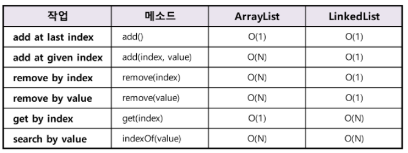

# Arraylist
## 특징
- Object[] 배열(객체 배열) 사용
- 동적 할당
- 빈공간 x -> 연속된 데이터 구조

## ArrayList 구현
```java
package algorithmStudyStringAndArray;

import Interface_form.List;

import java.util.Arrays;

public class ArrayList<E> implements List<E> {

    private static final int DEFAULT_CAPACITY = 10;//최소 할당 크기
    private static final Object[] EMPTY_ARRAY = {}; //빈 배열

    private int size; //요소 개수

    Object[] array; //요소를 담을 배열

    //생성자1 (초기 공간 할당 X)
    public ArrayList(){
        this.array = EMPTY_ARRAY;
        this.size = 0;
    }

    //생성자2 (초기 공간 할당 O)
    public ArrayList(int capacity){
        this.array = new Object[capacity];
        this.size = 0;
    }

    //동적할당을 위한 resize 메소드
    private void resize() {
        int array_capacity = array.length;

        //배열의 용량이 0일때
        if (Arrays.equals(array, EMPTY_ARRAY)) {
            array = new Object[DEFAULT_CAPACITY];
            return;
        }

        //용량이 꽉 찰 경우
        if (size == array_capacity) {
            int new_capacity = array_capacity * 2;

            //copy
            array = Arrays.copyOf(array, new_capacity);
            return;
        }

        //용량의 절반 미만으로 요소가 차지하고 있을 경우
        if (size < (array_capacity / 2)) {
            int new_capacity = array_capacity / 2;

            //copy
            array = Arrays.copyOf(array, Math.max(new_capacity, DEFAULT_CAPACITY));
            return;
        }
    }

    //add메소드 구현
    @Override
    public boolean add(E value){
        addLast(value);
        return true;
    }

    public void addLast(E value){

        //꽉차있는 상태라면 용량 재할당
        if(size == array.length){
            resize();
        }
        array[size] = value; // 마지막 위치에 요소 추가
        size++; //사이즈 1증가
    }

    //중간 삽입 메소드
    @Override
    public void add(int index, E value){
        if(index>size ||index<0){ //예외처리
            throw new IndexOutOfBoundsException();
        }
        if(index==size){//index가 마지막 위치라면 addlast
            addLast(value);
        }
        else{
            if(size == array.length){ //꽉 차있다면 용량 재할당
                resize();
            }

            //index 기준 후자에 있는 모든 요소를 한칸씩 뒤로 밀기
            for(int i =size;i>index;i--){
                array[i] = array[i-1];
            }

            array[index] = value; //index 위치에 요소 할당
            size++;
        }
    }
    //맨앞 삽입 메소드
    public void addFirst(E value){
        add(0,value);
    }

    //요소를 가져오는 get메소드
    @SuppressWarnings("unchecked")  // 선언안하면 타입 안정성 경고가 뜬다
                                    // 이유는 E타입은 Object[] 배열의 Object배열이다.
                                    // 즉, Object -> E타입으로 변환하는 것인데
                                    // 이 과정에서 변환할 수 없는 타입일 가능성이 있다는 경고
                                    // 우리가 add하여 받아드릴 데이터 타입은 E타입만 존재하기 때문에 무시하겠다는 뜻
    @Override
    public E get(int index){
        if(index>=size|| index<0){
            throw new IndexOutOfBoundsException();
        }

        //Object 타입에서 E타입으로 캐스팅 후 반환
        return (E) array[index];
    }

    //요소는 교체하는 set 메소드
    @Override
    public void set(int index, E value){
        if(index>=size ||index<0){
            throw new IndexOutOfBoundsException();
        }
        else{
            //해당 위치 요소 교체
            array[index]=value;
        }
    }

    //요소의 위치를 반환하는 메소드
    @Override
    public int indexOf(Object value){
        int i =0;

        //value와 같은 객체(요소 값)일 경우 i(위치) 반환
        for(i = 0; i<size;i++){
            if(array[i].equals(value)){
                return i;
            }
        }
        //일치하는 것이 없을 경우
        return -1;
    }

    //요소 위치를 반환하는 메소드인데 반대로 탐색
    public int lastIndexOf(Object value) {
        for(int i = size - 1; i >= 0; i--) {
            if(array[i].equals(value)) {
                return i;
            }
        }
        return -1;
    }


    //요소가 존재하는지 안하는지를 반환하는 메소드
    @Override
    public boolean contains(Object value){

        //0 이상이면 요소가 존재한다는 뜻
        if(indexOf(value)>=0){
            return true;
        }
        else{
            return false;
        }
    }

    //특정 index의 요소를 삭제하는 메소드
    @SuppressWarnings("unchecked")
    @Override
    public E remove(int index){
        if(index>=size|| index<0){
            throw new IndexOutOfBoundsException();
        }

        E element = (E) array[index]; //삭제될 요소를 반환하기 위해 임시로 담아둠
        array[index] = null;

        //삭제한 요소의 뒤에 있는 모든 요소들을 한칸씩 당겨옴
        for(int i=index;i<size;i++){
            array[i] =array[i+1];
            array[i+1]=null;
        }
        size--;
        resize();
        return element;
    }

    //특정 value를 리스트에서 찾아 삭제하는 메소드
    @Override
    public boolean remove(Object value){
        //삭제하고자 하는 요소의 인덱스 찾기
        int index = indexOf(value);

        //-1이라면 array에 요소가 없다는 의미이므로 false반환
        if(index ==-1){
            return false;
        }

        //index위치에 있는 요소를 삭제
        remove(index);
        return true;
    }

    //요소의 갯수를 구하는 size메소드
    @Override
    public int size(){
        return size; //요소 개수 반환
    }

    //ArrayList에 요소가 단 하나도 존재하지 않고 비어있는지 알려주는 메소드
    @Override
    public boolean isEmpty(){
        return size ==0;
    }

    //모든 요소를 없애는 clear 메소드
    @Override
    public void clear(){
        //모든 공간을 null 처리 해준다.
        for(int i=0;i<size;i++){
            array[i] = null;
        }
        size = 0;
        resize();
    }
}
```

## 시간복잡도


## 참고 문헌
[ArrayList 구현 참고문헌](https://st-lab.tistory.com/161?category=856997)