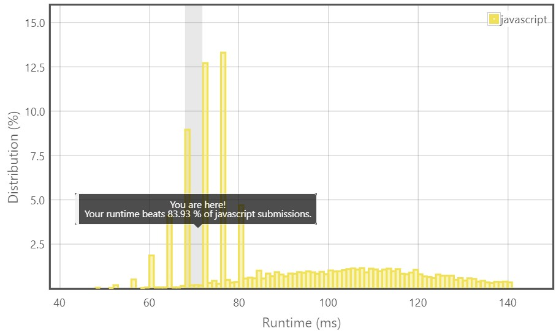
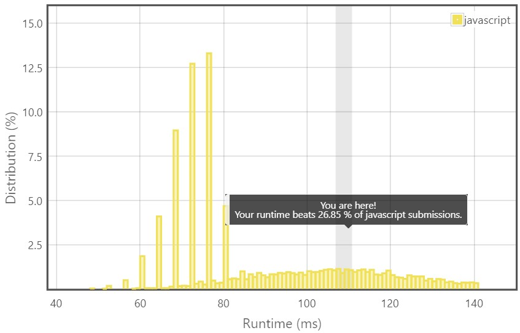

# 배열

> 각 문제의 👊를 클릭하면 문제로 이동합니다.

## 문제 리스트

<details>
<summary>
  35. Search Insert Position
  <a href="https://leetcode.com/problems/search-insert-position/">👊</a>
</summary>
<br/>

문제 조건에 시간 복잡도 `O(log n)`을 만족하라고 나와있었다.

즉, 이진 탐색 트리를 사용해서 풀어야했다.

이진 탐색 트리를 구현한 코드를 참고해서 
문제에서 요구하는 결과값을 도출할 수 있게 약간의 수정만 하면된다고 생각했다.
<br/>

트리의 하나의 노드를 구현체로 만들어 재귀적으로 호출하는 풀이를 봤는데, 상당히 구현해놓을 함수가 많았다.

이는 트리 주제때 확인하기로 하고, 현재로써 간단히 이진 탐색만 가능한 함수를 사용했다.

해당 문제가 Easy인 이유는 Input이 정렬된 배열이기 때문이라 보았다.

좀더 구현체를 활용한 코드들은 정렬되지 않은 배열일 때를 극복하는 경우라고 예상한다.

**문제 풀이 1/2 [재귀적 호출]**

    time: O(log n)

    1. 주어진 배열의 중간 인덱스값(이하 middle 값)가 target을 찾을때까지 루프를 돈다.
    2. middle 값을 기준으로 target이 작은 범위냐 큰 범위냐에 있으면 그 반대편 범위는 탐색 대상에서 제외한다.
    3. 그렇게 범위를 재조정했으면, 그 안에서 middle 값을 찾아 target을 계속 찾는다.

```js
/**
 * @param {number[]} nums
 * @param {number} target
 * @return {number}
 */
var searchInsert = function(nums, target) {
  var binarySearch = function(startIdx, endIdx, target){  
    while(startIdx <= endIdx){
      const midIdx = startIdx + Math.floor((endIdx - startIdx) / 2);

      if(nums[midIdx] === target)
        return midIdx;

      if(nums[midIdx] < target)      
        return binarySearch(midIdx + 1, endIdx, target);
      else      
        return binarySearch(startIdx, midIdx - 1, target);
    }
  
    return startIdx;
  }
  const endIdx = nums.length - 1;
  return binarySearch(startIdx=0, endIdx, target);
};
```

**문제 풀이 2/2 [하나의 루프에서 범위 재조정]**

좀 더 이해하기 쉬운 풀이이다.

    time: O(log n) 🤔 (확실하지 않다.)

    1. 주어진 배열의 중간 인덱스값(이하 middle 값)가 target을 찾을때까지 루프를 돈다.
    2. middle 값을 기준으로 target이 작은 범위냐 큰 범위냐에 있으면 범위를 재조정한다.
    3. 그렇게 범위를 재조정했으면, 그 안에서 middle 값을 찾아 target을 계속 찾는다.

```js
/**
 * @param {number[]} nums
 * @param {number} target
 * @return {number}
 */
var binarySearch = function(sortedArr, target){
  let startIdx = 0;
  let endIdx = sortedArr.length - 1;
  
  while(startIdx <= endIdx){
    const midIdx = startIdx + Math.floor((endIdx - startIdx) / 2);
    
    if(sortedArr[midIdx] === target)
      return midIdx;
    
    if(sortedArr[midIdx] < target)
      startIdx = midIdx + 1;
    else
      endIdx = midIdx - 1;
  }
  
  return startIdx;
}

var searchInsert = function(nums, target) {
  return binarySearch(nums, target);
};
```
하지만, 수행 시간에서 차이가 극명했다.

🤔 코드를 확인해보면 후자의 풀이도 이진 탐색 풀이는 맞다고 판단되지만, 
수행 시간에서 차이가 이렇게 나는 원인이 궁금하다.

<table>
  <tr>
    <th>재귀적 호출</th>
    <th>하나의 루프에서 범위 재조정</th>
  </tr>
  <tr>
    <td>
      
    </td>
    <td>
      
    </td>
  </tr>
</table>

</details>

<hr/>

## 참고문헌

[Binary Search code](https://velog.io/@yujo/JS이진-탐색Binary-Search) -- yujo