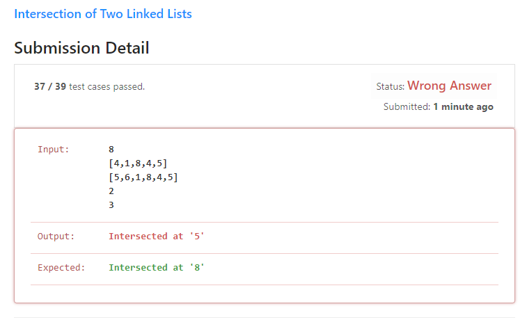

# LinkedList 리트코드 문제

## 목차
## 1290. Convert Binary Number in a Linked List to Integer
## 237. Delete Node in a Linked List
## 160. Intersection of Two Linked Lists


## 1290. Convert Binary Number in a Linked List to Integer

### 문제 요약
LinkedList의 데이터값은 0또는 1이고 이 LinkedList의 수를 나열한 이진수를 10진수로 구해라

### 문제 풀이
1. LinkedList의 헤드를 입력받음 ex) [1,0,1]
2. LinkedList를 for문으로 하나씩 탐색하되 2^연결리스트길이를 곱하여 새로운 변수에 대입


### 코드
```java
public class Solution {

    public static int getDecimalValue(ListNode head) {
        int res = 0;//10진수의 값을 더할 변수
        while(head != null){//ListNode의 끝까지 반복
            res = res*2;//값을 2곱함
            res += head.val;//ListNode의 데이터값을 더함
            head = head.next;//다음 노드로 연결
        }
        return res;
    }
}
```

### 풀이 해설
자바에 내장된 LinkedList를 사용하려고 했으나 LinkNode class를 제공해주어 head를 다음 head로 옮기며 *2를 수행함

### 시간복잡도
O(n)

### 다른 풀이
[연결리스트 값을 문자열로 변환후 2진수를 십진수로 변환](https://jaime-note.tistory.com/168)

[문자열로 변환후 parseInt](https://leetcode.com/problems/convert-binary-number-in-a-linked-list-to-integer/discuss/1739116/linkes-list-easy-to-understanding)


## 237. Delete Node in a Linked List

### 문제 요약
ListNode의 입력된 데이터 값을 없애고 노드를 다음 노드로 연결하시오

### 문제 풀이
1. !!해당 문제의 매개변수는 ListNode하나여서 없애고자하는 데이터 값을 어디서 가져오는 이해하지 못해 해답을 봄
2. 풀이를 본 결과 매개변수 ListNode에 연결리스트의 없애고자하는 데이터값이 head로 설정되어 있는 상황이였다.
3. ListNode의 데이터 값을 다음 데이터 값으로 설정
4. ListNode의 Node도 다음 Node로 설정

### 코드
```java
public class Solution {
    public void deleteNode(ListNode node) {
        node.val = node.next.val;
        node.next = node.next.next;
    }
}
```

### 시간복잡도
O(1)


## 160. Intersection of Two Linked Lists

### 문제요약
두 연결리스트의 교차점 찾아 반환하시오

### 문제 풀이
1. 연결리스트 A를 반복할때 안에서 연결리스트B.contain(A의 val)이  true이면 A의 val return

### 코드
```java
public class Solution {

    public class ListNode {
        int val;
        ListNode next;
        ListNode(int x) {
            val = x;
            next = null;
        }

    }

    public ListNode getIntersectionNode(ListNode headA, ListNode headB) {
        LinkedList<Integer> listA = new LinkedList<Integer>();
        ListNode m = headA;
        ListNode n = headB;

        while(m!=null){
            listA.add(m.val);
            m=m.next;
        }

        while(n!=null){
            if(listA.contains(n.val)) break;
            else n=n.next;
        }
        return n;
    }
}
```

### 틀린점


우선 headA에 4가 중복으로 나와서 틀렸다.

하지만 문제도 이해가 되지 않았다.

분명 1이 반환되어야하는데 8이 반환되었다....

후.....

### 해결방법
```java
public class Solution {
    public ListNode getIntersectionNode(ListNode headA, ListNode headB) { 
        HashSet<ListNode> set=new HashSet<>();
        ListNode p=headA;
        while(p!=null){ // headA의 노드들을 HashSet에 저장
            set.add(p);
            p=p.next;
        }
        
        p=headB;
        while(p!=null){ // headB 순회
            if(set.contains(p)) break; // headA와 같은 노드(교차점)를 발견했다면
            else p=p.next;
        }
        
        return p;
    }
}
```
hashset 자료구조를 통해 해결한 방법이다.


### 시간 복잡도
Linkedlist에서 contains는 O(n)인데

HashSet에서 contains는 O(1)이다.

고로 O(m + n)이다.