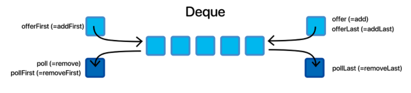

# Deque

## 정의


`Deque`는 `Queue` 인터페이스를 확장하고 있는 인터페이스이다. `Queue`는 한쪽 방향에서만 삽입, 삭제를 할 수 있지만, `Deque`는 양쪽 끝에서 삽입, 삭제가 가능하다.</br>
즉, 스택처럼도 사용 가능하고 큐 처럼도 사용할 수 있는 자료구조이다.

## ArratDeque 시간복잡도
| offer | peek | poll | size |
|------|-------|---|---|
| O(1) | O(1)  | O(1)  | O(1)  |

## ArrayDeque vs LinkedList Deque
자바에서는 Deque 인터페이스를 구현할 때 ArrayDeque으로 구현한다.

이유는 수행속도와 메모리에 관련해서 ArrayDeque가 더 유리하기 때문이다.</br>
(삽입/삭제가 양끝에서만 일어나기 때문에 둘다 시간복잡도는 O(1)로 거의 동일하다.)

- 수행속도 : ArrayDeque는 Array에 의해 지원되며 Array는 LinkedList보다 cache-locality에 좀 더 친숙하다.
- 메모리 : ArrayDeque는 다음 노드에 대한 추가 참조를 유지할 필요가 없으므로 LinkedList보다 메모리 효율적이다.
- null사용 여부 : LinkedList는 Null 요소를 추가할 수 있지만 ArrayDeque는 불가능하다.

## 스택 자료구조로 사용하는 ArrayDeque
**스택 구조** : 자료구조의 하나로 후입선출(Last In First Out) 자료구조</br>

Stack 클래스는 List 인터페이스의 Vector 클래스를 상속받아, 전형적인 스택 메모리 구조의 클래스를 제공한다.
```java
Stack<E> st = new Stack<E>();
```
</br>
ArrayDeque 클래스는 Deque인터페이스를 구현하고 있는 클래스이다.
```java
Deque<E> st = new ArrayDeque<E>();
```

ArrayDeque 공식문서를 보면

> This class is likely to be faster than Stack when used as a stack, and faster than LinkedList when used as a queue.

`스택구조로 사용하면 Stack 클래스보다 빠르고`, `큐 구조를 사용하면 Queue 클래스보다 빠르다`고한다.

> Using the Deque interface is the most convenient approach for LIFO data structures as it provides all the needed stack operations

이처럼 LIFO 구조를 만들기 위해 적합한 클래스는 ArrayDeque 클래스이다.

왜 그럼 이름을 Stack이라고 해서 헷갈리게 하는 것일까?

이유는 JAVA는 오랫동안 **잘못 작성된** Stack 구현을 가지고 있었다.
(JAVA는 Stack의 기본 원칙을 무시하고 Vector 클래스를 상속받고 있었다)

- Vector를 상속받는 다른 Stack클래스를 새로 만들경우 LIFO원칙이 아닌 중간에 데이터가 삽입되거나 삭제될 수 있는 치명적 문제 발생

하지만! JAVA는 이전 버전과의 호환성 원칙에 따라 **실수를 수정할 수가 없다**고 한다...

**[ Stack 클래스의 단점 ]**
- 모든 메소드에 synchronized가 있기 때문에 단일 스레드 환경에서는 성능이 떨어진다.
- Vector 클래스를 상속받았기 때문에 LIFO 구조를 유지하는 것이 아니라 중간에서 데이터를 삭제하고 삽입하는 것이 가능하다.
- Stack 클래스를 만들 때 초기 용량을 설정할 수 없다.

이러한 단점을 보완하기 위해 LIFO 구조를 만들 때 ArrayDeque를 사용해야한다.

### 결론
Vector를 상속받는 Stack의 장점이라고 하면 **Search()메소드**의 존재이다.

만약 LIFO구조가 필요할 때 배열처럼 특정 값의 위치를 스택에서 알고 싶다면 Stack을 사용하고</br>
그렇지 않은 경우에서는 ArrayDeque를 사용하는 것이 좋은 것 같다.


### 배열을 이용한 Deque
```java
package algorithmStudyDeque;
import Interface_form.Queue;

import java.util.NoSuchElementException;

public class ArrayDeque<E> implements Queue<E> {
    private static final int DEFAULT_CAPACITY = 64;//최소 용량 크기

    private Object[] array; //요소를 담을 배열
    private int size; //요소 개수

    private int front; //시작 인덱스를 가리키는 변수(빈 공감임)
    private int rear; //마지막 요소의 인덱스를 가리키는 변수

    //생성자
    public ArrayDeque(){
        this.array = new Object[DEFAULT_CAPACITY];
        this.size = 0;
        this.front =0;
        this.rear =0;
    }

    public ArrayDeque(int capacity){
        this.array = new Object[capacity];
        this.size = 0;
        this.front =0;
        this.rear =0;
    }

    //동적할당을 위한 resize 메소드
    private void resize(int newCapacity){
        int arrayCapacity = array.length;//현재 용량 크기

        Object[] newArray = new Object[newCapacity]; //용량을 변경한 배열

        for(int i=1,j=front+1;i<=size;i++,j++){
            newArray[i] = array[j%arrayCapacity];
        }

        this.array = null;
        this.array = newArray; //새 배열을 기존 array의 배열로 덮어 씌움

        front = 0;
        rear = size;
    }

    //삽입 메소드
    @Override
    public boolean offer(E item){
        return offerLast(item);
    }

    public boolean offerLast(E item){
        //용량이 가득 차면
        if((rear+1)% array.length == front){
            resize(array.length*2);
        }

        rear = (rear+1)% array.length;

        array[rear] = item;
        size++;

        return true;
    }

    public boolean offerFirst(E item){
        if((front -1+ array.length) % array.length == rear){
            resize(array.length*2);
        }

        array[front] = item;
        front = (front-1+ array.length) % array.length;
        size++;

        return true;
    }

    @Override
    public E poll(){
        return pollFirst();
    }

    public E pollFirst(){
        if(size==0){
            return null;
        }

        front = (front+1) % array.length;

        @SuppressWarnings("unchecked")
        E item = (E) array[front];
        array[front] =null;
        size--;

        if(array.length>DEFAULT_CAPACITY && size<(array.length/4)){
            resize(Math.max(DEFAULT_CAPACITY,array.length/2));
        }

        return item;
    }

    public E remove(){
        return removeFirst();
    }

    public E removeFirst(){
        E item = pollFirst();

        if(item ==null){
            throw new NoSuchElementException();
        }

        return item;
    }

    public E pollLast(){
        if(size ==0){
            return null;
        }

        @SuppressWarnings("unchecked")
        E item = (E) array[rear];
        array[rear] =null;

        rear = (rear-1+array.length)% array.length;
        size--;

        if(array.length > DEFAULT_CAPACITY && size < (array.length / 4)) {
            resize(Math.max(DEFAULT_CAPACITY, array.length / 2));
        }
        return item;
    }

    public E removeLast(){
        E item = pollLast();

        if(item == null){
            throw new NoSuchElementException();
        }
        return item;
    }

    @Override
    public E peek(){
        return peekFirst();
    }

    public E peekFirst(){
        if(size==0){
            return null;
        }

        @SuppressWarnings("unchecked")
        E item = (E) array[(front+1)% array.length];
        return item;
    }

    public E peekLast(){
        if(size==0){
            return null;

        }

        @SuppressWarnings("unchecked")
        E item = (E) array[rear];
        return item;
    }

    public E element() {
        return getFirst();
    }

    public E getFirst() {
        E item = peek();

        // 앞의 원소가 null 이라면(size = 0) 예외를 던진다.
        if(item == null) {
            throw new NoSuchElementException();
        }
        return item;
    }

    public E getLast() {
        E item = peekLast();

        // 앞의 원소가 null 이라면(size = 0) 예외를 던진다.
        if(item == null) {
            throw new NoSuchElementException();
        }
        return item;
    }

    public int size() {
        return size;
    }

    public boolean isEmpty() {
        return size == 0;
    }

    public boolean contains(Object value) {

        int start = (front + 1) % array.length;

        /**
         *  i : 요소 개수만큼만 반복한다.
         *  idx : 원소 위치로, 매 회 (idx + 1) % array.length; 의 위치로 갱신
         */
        for(int i = 0, idx = start; i < size; i++, idx = (idx + 1) % array.length) {
            if(array[idx].equals(value)) {
                return true;
            }
        }
        return false;
    }
```


## 연결리스트를 이용한 Deque
```java
package algorithmStudyDeque;

import Interface_form.Queue;

import java.util.NoSuchElementException;

public class LinkedListDeque<E> implements Queue<E>{
    private Node<E> head; //가장 앞에 있는 노드를 가르키는 변수
    private Node<E> tail; //가장 뒤에 있는 노드를 가리키는 변수
    private int size; //노드의 개수

    //생성자
    public LinkedListDeque(){
        head = null;
        tail = null;
        size =0;
    }

    public boolean offerFirst(E value){
        Node<E> newNode = new Node<E>(value); //새 노드 생성
        newNode.next = head; //새 노드의 다음 노드로 head 노드를 연결

        if(head != null){
            head.prev = newNode;
        }

        head = newNode;
        size++;

        if(head.next ==null){
            tail = head;
        }
        return true;
    }

    @Override
    public boolean offer(E value){
        return offerLast(value);
    }

    public boolean offerLast(E value){
        if(size ==0){
            return offerFirst(value);
        }

        Node<E> newNode = new Node<E>(value);

        tail.next = newNode;
        newNode.prev = tail;
        size++;

        return true;
    }

    @Override
    public E poll(){
        return pollFirst();
    }

    public E pollFirst(){
        if(size ==0){
            return null;
        }

        E element = head.data;
        Node<E> nextNode = head.next;

        head.data = null;
        head.next =null;

        if(nextNode != null){
            nextNode.prev = null;
        }
        head = null;
        head = nextNode;
        size--;

        if(size ==0){
            tail = null;
        }

        return element;
    }

    public E remove(){
        return removeFirst();
    }

    public E removeFirst(){
        E element = poll();

        if(element ==null){
            throw new NoSuchElementException();
        }
        return element;
    }

    public E pollLast(){
        if(size==0){
            return null;
        }

        E element = tail.data;
        Node<E> prevNode = tail.prev;

        tail.data = null;
        tail.prev =null;

        if(prevNode!=null){
            prevNode.next =null;
        }

        tail =null;
        tail = prevNode;
        size--;

        if(size ==0){
            head = null;
        }
        return element;
    }

    public E removeLast(){
        E element = pollLast();

        if(element ==null){
            throw new NoSuchElementException();
        }
        return element;
    }

    @Override
    public E peek(){
        return peekFirst();
    }

    public E peekFirst(){
        if(size ==0){
            return null;
        }
        return head.data;
    }

    public E peekLast(){
        if(size ==0){
            return null;
        }
        return tail.data;
    }

    public E element() {
        return getFirst();
    }

    public E getFirst(){
        E item = peek();

        if(item ==null){
            throw new NoSuchElementException();
        }
        return item;
    }

    public E getLast() {
        E item = peekLast();
        
        if(item == null) {
            throw new NoSuchElementException();
        }
        return item;
    }

    public int size() {
        return size;
    }

    public boolean isEmpty() {
        return size == 0;
    }

    public boolean contains(Object value) {
        for(Node<E> x = head; x != null; x = x.next) {
            if(value.equals(x.data)) {
                return true;
            }
        }
        return false;
    }

    public void clear() {
        for (Node<E> x = head; x != null;) {
            Node<E> next = x.next;
            x.data = null;
            x.next = null;
            x.prev = null;
            x = next;
        }
        size = 0;
        head = tail = null;
    }
}
```

## 참고 문헌
[arrayDeque vs Linkedlist Deque 관련 참고문헌](https://chucoding.tistory.com/52)

[스택자료구조에서 ArrayDeque를 사용하는 이유1](https://chucoding.tistory.com/50?category=880097)


[스택자료구조에서 ArrayDeque를 사용하는 이유2](https://github.com/wjdrbs96/Today-I-Learn/blob/master/Java/Collection/Queue/ArrayDeque%EB%9E%80%3F.md)