# 덱, 우선순위 큐

- [덱, 우선순위 큐](#덱-우선순위-큐)
  - [이론](#이론)
  - [구현문제 리스트](#구현문제-리스트)
    - [문제 회고](#문제-회고)
    - [문제 풀이](#문제-풀이)
    - [문제 회고](#문제-회고-1)
    - [문제 풀이](#문제-풀이-1)
  - [문제 리스트](#문제-리스트)
    - [문제 회고](#문제-회고-2)
    - [문제 풀이](#문제-풀이-2)
    - [문제 회고](#문제-회고-3)
    - [문제 풀이](#문제-풀이-3)
    - [문제 회고](#문제-회고-4)
    - [문제 풀이](#문제-풀이-4)
  - [참고 문헌](#참고-문헌)

## 이론

덱은

    Double-Ended Queue의 줄임말이다.

    주로, 이중 연결리스트 자료구조로 구현하는데, 
      1. 덱 자료구조의 의미에 맞고,
      2. 양쪽끝 추출의 시간 복잡도를 동일시 할 수 있기 때문이라 생각한다.

우선순위 큐는

    큐 또는 스택 자료구조와 유사하지만, 요소가 '우선순위'에 따라 정렬되어 있다.
                                                cf. 최솟값 또는 최댓값

    주로 힙 자료구조를 이용해 구현한다.

힙은 

    최솟값 또는 최댓값을 빠르게 찾아내기 위해 고안된 완전 이진 트리 이다.

    - 힙은 배열 자료형으로 구현한다.
      배열의 인덱스는 트리의 중위 순회를 의미한다.

    - 힙의 시간복잡도는 O(log n)이다.
      → 최솟값 또는 최댓값을 검색:    O(1)
      → 검색 이후 재정렬:             O(log n)

      이때, 최초 힙을 세팅하는 O(n)은 제외하였다.

## 구현문제 리스트

  641. Design Circular Deque
  <a href="https://leetcode.com/problems/design-circular-deque/">👊</a>  

### 문제 회고

이전 3주차의 `단일 연결리스트 구현`, 4주차의 `원형큐 구현`와 다르게
이중 연결리스트 자료구조를 이용해 원형 덱을 구현하였다.

front와 rear라는 각자의 위치가 있지만,
Insertion / Deletion의 행위에 의해 1개가 될 때 위치를 동기화하는 과정이 매우 어려웠다.

때문에 처음에 구상한 이상적인 구조가 나오지 못했고,
    

교재의 풀이를 참고하여 각자 위치를 나타내는 빈 노드를 거쳐가는 형식의 구조를 사용하니, 동기화 문제가 사라졌다.

빈 노드들은 덱의 사이즈에 영향을 주지 않는다.

### 문제 풀이

빅오를 한눈에 보자면 다음과 같다.

|       | `insertFront` | `insertLast` | `deleteFront` | `deleteLast` | `getFront` | `getRear` | `isEmpty` | `isFull` |
| :---: | :-----------: | :----------: | :-----------: | :----------: | :--------: | :-------: | :-------: | :------: |
| time  |    `O(1)`     |    `O(1)`    |    `O(1)`     |    `O(1)`    |   `O(1)`   |  `O(1)`   |  `O(1)`   |  `O(1)`  |
| space |    `O(1)`     |    `O(1)`    |    `O(1)`     |    `O(1)`    |   `O(1)`   |  `O(1)`   |  `O(1)`   |  `O(1)`  |

문제 풀이는 `src\adt\CircularDeque.js`에서 확인할 수 있다.

  7662. 이중 우선순위 큐
  <a href="https://www.acmicpc.net/problem/7662">👊</a>  

### 문제 회고

힙 자료구조 기반으로 구현하였다.

`이중 우선순위 큐`라는 단일 자료구조를 만든 것이 아닌,
`최대힙`, `최소힙` 총 2개의 자료구조를 이용하였다.

이 2개의 자료구조 구현의 전체적인 틀은 참고를 하였고, 문제 조건에 필요한 메소드 몇개만 직접 구현하였다.

### 문제 풀이

빅오를 한눈에 보자면 다음과 같다.

|       |  `insert`  | `extract`  | `findIndex` |  `delete`  |
| :---: | :--------: | :--------: | :---------: | :--------: |
| time  | `O(log n)` | `O(log n)` | `O(log n)`  | `O(log n)` |
| space |   `O(1)`   |   `O(1)`   |   `O(1)`    |   `O(1)`   |

문제 풀이는 `src\7662`폴더에서 확인할 수 있다.

- `7662.js`가 문제 제출 형식을 맞춘 파일이다.
- `stdin-7662`는 문제에서 제공한 입력 예제이다.
    > 파일 형식을 사용한 이유는 노드 환경에서 표준 입출력을 받는 작업이 어렵기 때문이다.

<dl><dt>
문제에서 제공한 출력 예제가 정상적으로 나왔지만, 제출에서 메모리 초과 오류가 있다.
</dt></dl>                

    Ouput:          EMPTY
                    333 -45

    Display Heap:   MaxHeap { heap: [ 333, -642, -45, [length]: 3 ] }
                    MinHeap { heap: [ -45, 45, 333, [length]: 3 ] }

## 문제 리스트

  1021. 회전하는 큐
  <a href="https://www.acmicpc.net/problem/1021">👊</a>  

### 문제 회고

`641번`의 자료구조 구현 파일을 그대로 사용하였다.

### 문제 풀이

문제 풀이는 `src\1021`폴더에서 확인할 수 있다.

**문제 설명**

    Input:  10 3
            2 9 5

    Output: 8

    a. 10은 덱에 다음과 같이 채워져야 함을 의미한다.
    
      [HEAD] size: 10   elements: undefined → 1 → 2 → 3 → 4 → 5 → 6 → 7 → 8 → 9 → 10 → undefined →      

    b. 3은 [2, 9, 5] 즉, 제거할 요소들의 개수이다.

    c. 루프에 따른 결과값
    
      [element = 2] 일때, 덱의 앞으로 회전해야 효율적이다.
      회전한 후,  
        [HEAD] size: 10   elements: undefined → 2 → 3 → 4 → 5 → 6 → 7 → 8 → 9 → 10 → 1 → undefined →

      제거한다.
        [HEAD] size: 9    elements: undefined → 3 → 4 → 5 → 6 → 7 → 8 → 9 → 10 → 1 → undefined →        

      [element = 9] 일때, 덱의 뒤에서 회전해야 효율적이다.
      회전한 후,          
        [HEAD] size: 9    elements: undefined → 9 → 10 → 1 → 3 → 4 → 5 → 6 → 7 → 8 → undefined →

      제거한다.
        [HEAD] size: 8    elements: undefined → 10 → 1 → 3 → 4 → 5 → 6 → 7 → 8 → undefined →

문제의 핵심은

    a. 회전의 기준이다.

       회전의 기준은 (deque.size) / 2이고, 홀수 일때, 올림한다.

        1 → 2 → 3이 있을때 올림값을 한 2를 회전의 기준으로 잡으면
        1, 2는 앞으로 3은 뒤로 돈다.
        
        이게 빠르다고 한다.

    b. 삭제하는 곳이다.

        1 → 2 → 3 → 4 → 5에서 3에 접근할때,

        덱의 뒤에서 접근여 2번이 나오더라도,

        4 → 5 → 1 → 2 → 3

        앞에서 삭제해야하기 때문에 1번을 더 이동시켜줘야한다.

        3 → 4 → 5 → 1 → 2
        
<dl><dt>
문제에서 제공한 모든 예제에 출력이 정상적으로 나왔지만, 제출이 되지 않았다.
</dt></dl>

  2346. 풍선 터뜨리기
  <a href="https://www.acmicpc.net/problem/2346">👊</a>  

### 문제 회고

`1021번`과 유사하다.

### 문제 풀이

문제 풀이는 `src\2346`폴더에서 확인할 수 있다.

**문제 설명**

    Input:  5
            3 2 1 -3 -1

    Output: 1 4 5 3 2
  
    a. head를 삭제하고,
      size: 5   elements: 3 → 2 → 1 → -3 → -1 →

    b. head value만큼 회전시킨다.
      size: 4   elements: -3 → -1 → 2 → 1 →

      ...
      size: 3   elements: -1 → 2 → 1 →
      size: 2   elements: 1 → 2 →
      size: 1   elements: 2 →
    
    c. Ouput은 삭제된 head가 Input의 몇 번째 요소인지를 배열로 나타낸다.

  1046. Last Stone Weight
  <a href="https://leetcode.com/problems/last-stone-weight/">👊</a>  

### 문제 회고

`7662번`에서 구현한 자료구조가 필요하기 때문에 별도의 소스 코드에 기술하였다.

### 문제 풀이

문제 풀이는 `src\1046.js`에서 확인할 수 있다.

## 참고 문헌

**자료구조 이론**

[Heap 특성](https://1ilsang.dev/2019-10-21/algorithm/heap) ━ *1ilsang*

**자료구조 구현**

[My Solution at 707. Design Linked List](https://github.com/cs-study-org/algorithm-study/blob/master/03/yongki/LinkedList.md) ━ *GitHub*

[My Solution at 622. Design Circular Queue](https://github.com/cs-study-org/algorithm-study/blob/master/04/yongki/src/circularQueue.js) ━ *GitHub*

[이중 연결 리스트 구현](https://makasti.tistory.com/96) ━ *두콩*

[Heap 삭제 과정](https://www.geeksforgeeks.org/insertion-and-deletion-in-heaps/) ━ *GeeksforGeeks*

[Heap 시각화](https://visualgo.net/en/heap) ━ *VisuAlgo*

[Javascript Heap 구현](https://nyang-in.tistory.com/153) ━ *냥인*

[Javascript 객체 상속](https://www.zerocho.com/category/JavaScript/post/573d812680f0b9102dc370b7) ━ *ZeroCho*

**풀이 참고**

[Simple Solution at 1021. 회전하는 큐](https://wiselog.tistory.com/126) ━ *지혜로운 개발로그*

**백준 제출**

[Javascript 표준 입출력과 백준 제출 팁](https://overcome-the-limits.tistory.com/25) ━ *Plus Ultra*

[Javascript 표준 입출력과 백준 이슈](https://broadway.tistory.com/entry/자바스크립트-백준-입력받는법) ━ *이너멜*

[백준 제출 형식](https://velog.io/@mttw2820/백준-7662.-이중-우선순위-큐) ━ *mttw2820*