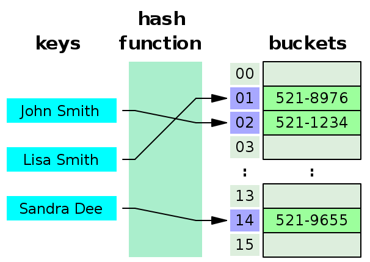
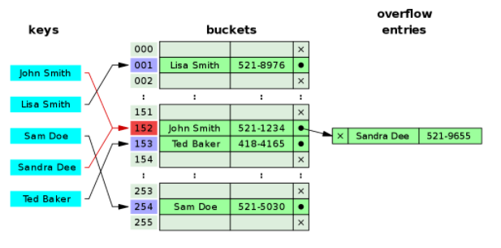
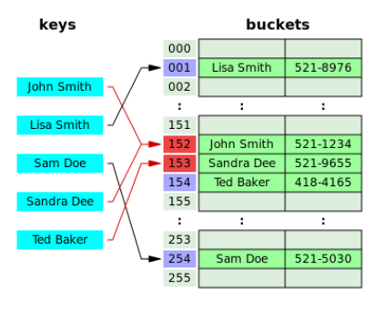
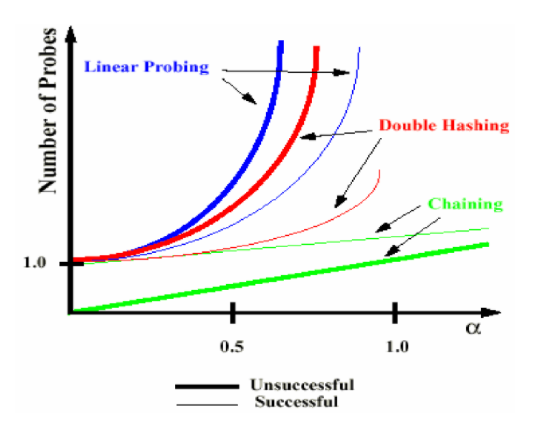

# Hash

## HashTable

### HashTable 개념
- Key와 Value를 1:1로 연관지어 저장하는 자료구조( 연관배열 구조)
- Key를 이용하여 Value 도출

### HashTable 기능
- 연관배열 구조와 동일한 기능 지원
- Key, Value가 주어졌을때, 두 값을 저장
- Key가 주어졌을 때, 해당 Key에 연관된 Value 조회
- 기존 Key에 새로운 Value가 주어졌을 때, 기존 Value를 새로운 Value로 대체
- Key가 주어졌을 때, 해당 Key에 연관된 Value 제거

### HashTable 구조


> Key, Hash Function, Hash, Value, 저장소(Buckey, Slot)로 구성

- Key
  - 고유한 값
  - 저장 공간의 효율성을 위해 Hash Function에 입력하여 Hash로 변경 후 저장
    - Key는 길이가 다양하기 때문에 그대로 저장하면 다양한 길이만큼 저장소 구성이 필요
- Hash Function
  - Key를 Hash로 바꿔주는 역할
  - 해시 충동(서로 다른 Key가 같은 Hash가 되는 경우)이 발생할 확률을 최대한 줄이는 함수를 만드는 것이 중요
- Hash
  - Hash Function의 결과
  - 저장소에서 Value와 매칭되어 저장
  - 저장소에서 Value의 인덱스 값
- Value
  - 저장소에 최종적으로 저장되는 값
  - 키와 매칭되어 저장, 삭제, 검색, 접근 가능

### HashTable 동작 과정
1. Key -> Hash Function -> Hash Function 결과 = Hash
2. Hash를 배열의 Index로 사용
3. 해당 Index에 Value 저장

ex) HashTable 크기가 10이라면 A라는 Key의 Value를 찾을 때 HashFunction("A") % 10 연산을 통해 인덱스 값 계산하여 Value 조회


### Hash 충돌
- 서로 다른 Key가 Hash Function에서 중복 Hash로 나오는 경우
- 충돌이 많아질수록 탐색의 시간 복잡도가 O(1)에서 O(n)으로 증가

### Hash 충돌 해결 방법 - 해시테이블 기법 (Chaining vs Open Addressing)
#### Separate Chaining(분리 연결법)


**체이닝 기법이란 충돌이 발생했을 때 이를 동일한 버킷(Bucket)에 저장하는데 이를 연결리스트 형태로 저장하는 방법**이다.<br/>

위 사진을 보면 `John Smith`와 `Sandra Dee`의 인덱스가 152로 충돌하게 된 경우인데, 이 때 `Sandra Dee`를 `Jojn Smith` 뒤에 연결함으로 써 충돌을 처리하는 것을 볼 수 있다.

자바 8에서는 연결 리스트 구조를 좀 더 최적화 해서, 데이터의 개수가 많아지면 Red-Black Tree에 저장하는 형태로 병행하기로 했다.

> 데이터가 많다는 것의 기준은 무엇일까?
> 기준은 하나의 해시 버킷에 할당된 Key-Value 쌍의 개수이다.
> 이 Key-Value의 개수가 6개 이하, 8개 이상을 기준으로 결정한다.
> 
> 그럼 7은 어디로 갔는가?
> 링크드 리스트의 기준과 트리의 기준을 6과 8로 잡은 것은 변경하는데 소요되는 비용을 줄이기 위함이다.
> 예를 들어 설명하자면, 해시 버킷에 **6개**의 Key-Value 쌍이 들어있었다. 그리고 하나의 값이 추가되었다. 만약 기준이 6과 7이라면 자료구조를 링크드 리스트에서 트리로 변경해야한다. 그러다 바로 하나의 값이 삭제된다면 다시 트리에서 링크드 리스트로 자료구조를 변경해야한다.
> 넘기는 기준이 1이라면 Switching 비용이 너무 많이 필요하기 때문에 2라는 여유를 남겨두고 기준을 잡아준 것이다.
> 따라서 데이터의 개수가 **6->7이면 Linked List**일 것이고, **8->7이면 Red-Black Tree**일 것이다.

**< 연결리스트를 사용하는 방식(Linked List) >**
각각의 Bucket들을 Linked List로 만들어 충동(Collision)이 발생하면 해당 Bucket의 Linked List에 추가하는 방식이다.
- 연결리스트의 특징을 그래도 이어받아 삭제, 삽입이 간단하다.
- 작은 데이터들을 저장할 때 Linked List 자체의 오버 헤드가 부담이 된다.
- Bucket을 계속해서 사용하는 Open Address 방식에 비해 테이블 확장을 늦출 수 있다.

**< Tree를 사용하는 방식(Red-Black Tree) >**
알고리즘은 기본 Separate Chaining 방식과 동일하며 Linked List 대신 Tree를 사용하는 방식이다. 데이터가 많아지면 Red-Black Tree 사용


#### Open Addressing(개방 주소법)

**해시 충돌이 발생하면 다른 버킷에 데이터를 삽입하는 방식(데이터의 주소값이 바뀜)**<br/>

개방 주소법은 대표적으로 3가지가 있음
- 선형 탐색(Linear Probing) : 해시 충돌시 다음 버켓, 혹은 몇 개를 건너 뛰어 데이터를 삽입한다.
- 제곱 탐색(Quadratic Probing) : 해시 충돌시 제곱만큼 건너뛴 버켓에 데이터를 삽입(1,4,9,16,..)
- 이중 해시(Double Hashing) : 해시 충돌시 다른 해시함수를 한번 더 적용한 결과를 이용한다.

### Chaining vs Open Addressing


- successful search : 찾고자하는 데이터가 해시테이블에 있는 경우
- unsuccessful search : 찾고자하는 데이터가 해시테이블에 없는 경우

- 체이닝 : 연결 리스트를 사용하여 복잡한 계산식을 개방주소법에 비해 적게 사용, 해시테이블이 채워질수록 성능 저하가 선형적으로 발생
- 개방주소법 : 포인터가 필요 없고 지정한 메모리 외 추가적인 공간도 필요없음. 삽입, 삭제시 오버헤드가 적고, 저장할 데이터가 적을 때 더 유리


### HashTable의 장점
- 적은 리소스로 많은 데이터를 효율적으로 관리 가능
  - ex. HDD. Cloud에 있는 많은 데이터를 Hash로 매핑하여 작은 크기의 시 메모리로 프로세스 관리 가능
- 배열의 인덱스를 사용하기 때문에 빠른 검색, 삽입, 삭제의 시간복잡도 : O(1)
  - HashTable의 경우 인덱스는 데이터의 고유 위치이기 때문에 삽입, 삭제 시 다른 데이터를 이동할 필요가 없어 삽입, 삭제도 빠른 속도 가능
- Key와 Hash에 연관성이 없어 보안 유리
- 데이터 캐싱에 많이 사용
  - get, put 기능에 캐시 로직 추가시 자주 hit하는 데이터 바로 검색 가능
- 중복 제거 유용

### HashTable 단점
- 충돌 발생 가능성
- 공간 복잡도 증가
- 순서 무시
- 해시 함수에 의존


## Java에서의 Hash

```java
// HashMap
Map<Integer, String> map = new HashMap<>();
map.put(1, "one");
map.put(2, "two");

System.out.println(map.get(1)); // one
System.out.println(map.get(2)); // two

// Hashtable
Map<Integer, String> table = new Hashtable<>();
table.put(1, "one");
table.put(2, "two");

System.out.println(table.get(1)); // one
System.out.println(table.get(2)); // two
```

### HashTable vs HashMap
- Key-Value 구조 및 Key에 대한 Hash로 Value 관리하는 것은 동일
- 속도
  - HashMap > HashTable(HashTable은 다른 스레드가 block되고 unblock 되는 대기 시간을 기다리기 때문)

- HashTable
  - 동기(병렬 처리를 할 때)
    - 동기화된(Synchronized) 메소드로 구성
    - Thread-safe
  - Key-Value 값으로 null 미허용(Key가 hashcode(), equals()를 사용하기 때문)
  - 보조 Hash Function과 separating Chaining을 사용해서 비교적 충돌 덜 발생(Key의 Hash 변형)
- HashMap
  - 비동기(병렬 처리를 하지 않을 때)
    - Thread-safe하지 않다.
  - Key-Value 값으로 Null 허용


## Java HashTable 구현
### Chainiing 방식 구현
```java
//hashitem 클래스 : 키와 값을 저장할 클래스
public class HashItem {
    private int key;
    private int value;
    private HashItem nextHashItem;//다음 항목

    //생성자
    public HashItem(int key,int value){
        this.key = key;
        this.value = value;
    }

    public HashItem getNextHashItem() {
        return nextHashItem;
    }

    public int getValue() {
        return value;
    }

    public void setNextHashItem(HashItem nextHashItem) {
        this.nextHashItem = nextHashItem;
    }

    public void setValue(int value) {
        this.value = value;
    }

    public void setKey(int key) {
        this.key = key;
    }

    public int getkey() {
        return key;
    }
}
```

```java
package algorithmStudyHashTable;

//Constants 클래스 : 해시테이블의 크기를 상수로 보관
public class Constants {

    private Constants(){

    }

    public static final int TABLE_SIZE = 10;
}
```

```java
package algorithmStudyHashTable;

public class HashTable {

    private HashItem[] hashTable;

    public HashTable(){
        this.hashTable = new HashItem[Constants.TABLE_SIZE];
    }

    private int hash(int key){
        //키 % 테이블 사이즈
        return key%Constants.TABLE_SIZE;
    }

    //삽입
    public void put(int key, int value){
        //키를 해싱
        int hashArrayIndex = hash(key);

        //해시 테이블의 슬록이 비어 있으면 바로 삽입
        if(hashTable[hashArrayIndex] ==null){
            System.out.println("충돌없이 삽입!");
            hashTable[hashArrayIndex] = new HashItem(key, value);
        }
        else{
            System.out.println("충동 발생!" + key);
            HashItem hashItem = hashTable[hashArrayIndex];//해시테이블 슬록에 저장된 첫번 째 데이터를 가져옴

            //연결리스트 마지막까지 탐색을 수행
            while(hashItem.getNextHashItem() != null){
                hashItem = hashItem.getNextHashItem();
                System.out.println("연결리스트로 다음 리스트에 저장" + hashItem.getValue());
            }

            //마지막으로 연결리스트 다음에 삽입
            System.out.println("연결리스트에 삽입!");
            hashItem.setNextHashItem(new HashItem(key, value));
        }
    }

    //반환
    public int get(int key){

        //입력받을 키값을 해싱
        int generatedArrayIndex = hash(key);

        //해시 값에 해당하는 슬롯에 데이터가 없으면 -1 리턴
        if(hashTable[generatedArrayIndex] ==null){
            return -1;
        }
        else{ //해시 값에 해당하는 슬록에 데이터가 있는 경우

            //첫번째 값 추출
            HashItem hashItem = hashTable[generatedArrayIndex];

            //입력 키 값과 항목의 키값이 일치할 때까지 탐색
            while(hashItem != null && hashItem.getkey() != key){
                hashItem = hashItem.getNextHashItem();
            }

            //마지막까지 탐색한 뒤 일치하는 값을 못찰을 경우 -1 리턴
            if(hashItem == null){
                return -1;
            }else{
                return hashItem.getValue();
            }
        }
    }
}
```


