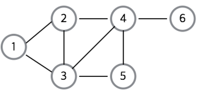
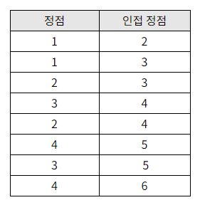
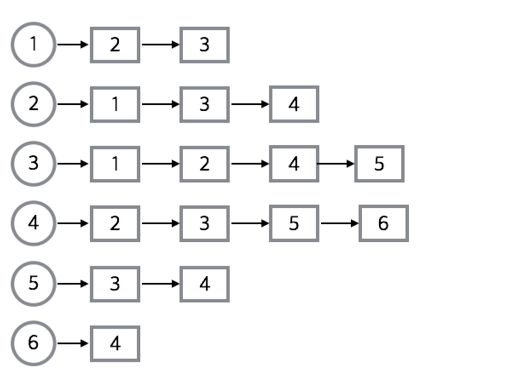
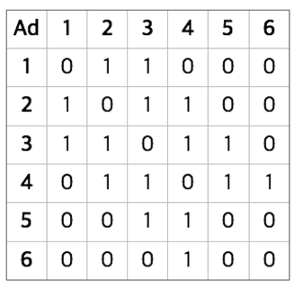

# Graph

## Graph란?
수학적 정의로 그래프는 객체들의 쌍들이 서로 연관되어 객체의 집합을 이루는 구조를 의미한다.

즉, **연결되어 있는 객체간의 관계를 표현할 수 있는 자료구조**이다.
- 도시를 연결하는 도로망이나 사람들 간의 관계, 웹 사이트의 링크 관계 들이 이에 해당하는 예시이다.

### 그래프 vs 트리
|  | 그래프 | 트리  |
|------|-------|---|
| 정의 | 노드와 그 노드를 연결하는 간선을 하나로 모아놓은 자료구조  | 그래프의 한 종류  DAG(Directed Acyclic Graph, 방향성이 있는 비순환 그래프)의 한 종류  |
| 방향성   |  방향 그래프  무향방 그래프 모두 존재     | 방향 그래프  |
|  사이클    |   사이클o  자체 간선o  순환 그래프, 비순환 그래프 모두 존재  | 사이클x  자체 간선x  비순환 그래프  |
|  루트 노드  | 이딴거 없음 | 한 개의 루트 노드만이 존재  모든 자식 노드는 한 개의 부모 노드만을 가짐  |
|  부모 - 자식  | 이딴거 없음 | 부모 - 자식 관계  top - bottom또는 bottom - top으로 이루어짐  |
| 모델 | 네트워크 모델 | 계층 모델 |
| 순회 | DFS, BFS | DFS, BFS안의 Pre-, In-, Post-order |
| 간선의 수 | 그래프의 따라 간선의 수가 다름  간선이 없을 수도 있음 | 노드가 N인 트리는 항상 N-1의 간선을 가짐 |
| 경로 | - | 임의의 두 노드 간의 경로는 유일 |
| 예시 및 종류 | 지도, 지하철 노선도의 최단 경로, 전기 회로의 소자들 | 이진트리, 이진 탐색 트리  균형 트리(AVL 트리, red-black 트리)  이진 힙(최대힙, 최소힙) 등 |

### 그래프의 구성요소
- 정점(Vertex / Node)
  - 그래프에서 위치를 나타낸다.
- 간선( Edge / Link / Branch )
  - 그래프에서 위치 간의 관계를 나타낸다. 즉, 각 정점(노드)를 연결하는 선을 의미한다.
- 인접 정접(Adjacent Vertex)
  - 간선(Edge)에 의해 직접 연결된 정점을 의미한다.
- 정점의 차수(degree)
  - 무방향 그래프에서 하나의 정점에 인접한 정점의 수
- G(V,E)
  - 그래프는 정점과 간선의 집합이므로 G(V,E)는 그래프 자체를 의미한다.

### 그래프의 종류
- 무방향 그래프
  - 간선을 통해 양방향으로 이동할 수 있는 그래프
  - G(A,B)는 G(B,A)와 동일
  - Ex) 양방향 통행 도로
- 방향 그래프
  - 간선에 방향이 존재하는 그래프
  - G(A,B)와 G(B,A)는 다름
  - Ex) 일방 통행

- 가중치 그래프
  - 간선에 비용 또는 가중치가 할당된 그래프
  - '네트워크'라고도 함
  - Ex) 도시-도시의 연결, 도로의 길이, 회로 소자의 용량, 통신망의 사용료 등

- 연결 그래프
  - 무방향 그래프에서 모든 정점쌍들에 대해 항상 경로가 존재하는 그래프
  - Ex) 트리: 사이클을 가지지 않는 연결 그래프
- 비연결 그래프
  - 무향향 그래프에서 특정 정점쌍들에 경로가 존재하지 않는 그래프

- 순환 그래프(Cycle)
  - 단순경로[^SimplePath]의 시작 정점과 종료 정점이 동일한 경우
- 비순환 그래프(Acyclic Graph)
  - 순환이 없는 그래프

[^SimplePath]: 경로 중에서 반복되는 정점이 없는 경우

## 그래프의 표현
그래프를 구현하는 방법은 일반적으로 `인접리스트`와 `인접행렬` 방식이 있다.
이 두가지 방식은 서로 정 반대의 특징을 갖기 때문에 한 방식의 장점이 다른 방식의 단점이 되는 경우가 나온다. 고로 구현하려는 알고리즘, 그래프의 종류에 따라 적절하게 사용하여야 한다.

아래는 그래프의 예시 이며 표는 그래프의 정점과 정점간의 관계에 대해 나타낸 것이다.

해당 그래프를 예시로 구현해 볼 예정이다.

### 인접 리스트를 통한 그래프
인접 리스트로 그래프를 표현하는 것이 **가장 일반적인 방법**이다.

- 모든 정점을 인접 리스트에 저장한다. 즉, 각각의 정점에 인접한 정점들을 리스트로 표시한 것이다.
  - 배열과 배열 각 인덱스마다 존재하는 또 다른 리스트(배열, ArrayList, LinkedList, 등)를 이용해서 인접 리스트를 표현
  - 정점의 번호만 알면 이 번호를 배열의 인덱스로 하여 각 정점의 리스트에 쉽게 접근 가능
- 무방향 그패프에서 (a,b)간선은 두 번 저장된다.
  - 정점의 수: N, 간선의 수: E인 무방향 그래프의 경우
    - N개의 리스트, N개의 배열, 2E개의 노드가 필요
- 트리에선 특정 노드 하나(루트 노드)에서 다른 모든 노드로 접근이 가능
  - 그래프에선 특정 노드에서 다른 모든 노드로 접근이 가능하지 않음

아래 사진은 각 정점마다 이어지는 간선의 목록을 표현한 것이다.

#### 구현
ADT/beom/Graph/Adjacencylist.java와

ADT/beom/Graph/ListGraph.java파일에 구현해 놓았다.

### 인접 행렬을 통한 그래프
인접 행렬은 N x N 불린 행렬(Boolean Matrix)로썬 matrix[i][j]가 true라면 i -> j로 간선이 있다는 뜻이다.

- 정점의 개수가 N인 그래프를 인접 행렬로 표현
  - 간선의 수와 무관하게 항상 공간복잡도는 O(n^2)를 가진다.
- 무방향 그래프를 인접 행렬로 표현한다면 이 행렬은 대칭 행렬이 된다.
  - 물론 방향 그래프는 대칭 행렬이 안 될 수 있음
- 인접 리스트를 사용한 알고리즘들(Ex. 너비 우선 탐색) 또한 인접 행렬에서도 사용 가능하다.
  - 하지만 **효율성이 떨어짐**
  - 인접 리스트는 어떤 노드에 인접한 노드들을 쉽게 찾을 수 있지만 인접 행렬에서는 **인접한 노드를 찾기 위해서는 모든 노드를 전부 순회해야 한다.**

- 0과 1를 이용한 정수 행렬(Integer Matrix)을 사용할 수도 있다.

아래 사진은 정수 행렬이면서 양방향 인접행렬의 목록을 표현한 것이다.

#### 구현

ADT/beom/Graph/AdjacencyArray.java와

ADT/beom/Graph/ArrGraph.java 파일에 구현해 놓았다.

### 인접 리스트와 인접 행렬 중 선택 방법
- 인접 리스트
  - 그래프 내에 적은 숫자의 간선만 가지는 **희소 그래프(Sparse Graph)**의 경우
  - 장점
    - 어떤 정점에 **인접한 정점**들을 쉽게 찾을 수 있다.
    - 모든 간선의 수 공간 복잡도 : O(N+E)
  - 단점 
    - 간선의 존재 여부와 정점의 차수 : 정점 i의 리스트에 있는 정점의 수. 즉, 정점 차수만큼의 시간복잡도 증가 = O(차수)
- 인접 행렬
  - 그래프에 간선이 많이 존재하는 **밀집 그래프(Dense Graph)**의 경우
  - 장점
    - 두 정점을 연결하는 **간선 조회의 시간 복잡도** : O(1)
    - 정점의 차수는 O(N) 안에 알 수 있다. : 인접 배열의 i번 째 행 또는 열을 모두 더한다.
  - 단점
    - 인접한 정점들을 찾기 위해서는 모든 정점를 전부 순회해야함
    - 모든 간선의 수 공간 복잡도 : O(N^2)
  

## 그래프 탐색

### DFS - 깊이 우선 탐색
> 루트 노드 혹은 임의 노드에서 **다음 브랜치로 넘어가기 전에, 해당 브랜치를 모두 탐색**하는 방법

- 구현 방법
  - 스택
  - 재귀함수

- 사용하는 경우
  - 모든 경로를 방문해야하는 경우

- 시간 복잡도
  - 인접 행렬 : O(V^2) //정점의 제곱
  - 인접 리스트 : O(V+E) // 정점 + 간선

### BFS - 너비 우선 탐색
> 루트 노드 또는 임의 노드에서 **인접한 노드부터 먼저 탐색**하는 방법

- 구현 방법 : 큐(해당 노드의 주변부터 탐색해야하기 때문에)

- 사용하는 경우
  - 최소 비용(모든 곳을 탐색하는 것이 아닌 최단 거리가 필요할 때)에 적합
  - 간선의 가중치가 1일때
  - 정점과 간선의 개수가 적을때

- 시간 복잡도
  - 인접 행렬 : O(V^2) //정점의 제곱
  - 인접 리스트 : O(V+E) //정점 + 간선

## 참고문헌
[그래프 기본 개념 참고 문헌](https://gmlwjd9405.github.io/2018/08/13/data-structure-graph.html)

[그래프 구현 참고문헌](https://freestrokes.tistory.com/87)