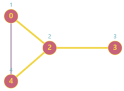
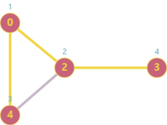
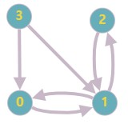

# 그래프

- [그래프](#그래프)
  - [이론](#이론)
  - [문제 리스트](#문제-리스트)
    - [문제 회고](#문제-회고)
    - [문제 풀이](#문제-풀이)
    - [문제 회고](#문제-회고-1)
    - [문제 풀이](#문제-풀이-1)
    - [문제 회고](#문제-회고-2)
    - [문제 풀이](#문제-풀이-2)
    - [문제 회고](#문제-회고-3)
    - [문제 풀이](#문제-풀이-3)
    - [문제 회고](#문제-회고-4)
    - [문제 풀이](#문제-풀이-4)
  - [참고 문헌](#참고-문헌)

## 이론

 

그래프는 2가지로 표현할 수 있다.

그래프의 정점을 나타내는 자료구조는 Map과 배열을 사용할 수 있는데,

이는 정점의 value가 숫자가 아니면 Map을 숫자면 배열을 사용해도 된다.

1. 인접 행렬    
   
    그래프의 정점 수가 n이라면, n x n의 2차원 배열 M을 생성한다.

       if(간선(vertexA, vertexB)가 존재하면)
          M[vertexA][vertexB] = 1
       else                                  
          M[vertexA][vertexB] = 0

    장점은

       정점과 간선의 Search 행위에 O(1) 소요된다.

    단점은

       간선의 수와 무관하게 n²개의 메모리 공간이 필요하다.

    필수 메소드의 시·공간 복잡도는

    |       | `insertVertex` | `insertEdge` | `deleteVertex` | `deleteEdge` | `adjacent` |
    | :---: | :------------: | :----------: | :------------: | :----------: | :--------: |
    | time  |    `O(n²)`     |    `O(1)`    |     `O(1)`     |    `O(1)`    |   `O(1)`   |
    | space |     `O(1)`     |    `O(1)`    |     `O(1)`     |    `O(1)`    |   `O(1)`   |

2. 인접 리스트
    
    배열의 인덱스는 그래프의 정점을 나타내며
    
    배열의 요소는 각각의 정점에 인접한 정점들을 연결 리스트로 표시한다.

    차수를 어떤 정점에 부속된 간선의 수를 말하는데, d라고 표현하겠다.

    장점은

       정점의 Search 행위에 O(1) 소요된다.

    단점은

       간선의 Search 행위에 O(d) 소요된다.

    필수 메소드의 시·공간 복잡도는

    |       | `insertVertex` | `insertEdge` | `deleteVertex` | `deleteEdge` | `adjacent` |
    | :---: | :------------: | :----------: | :------------: | :----------: | :--------: |
    | time  |     `O(1)`     |    `O(1)`    |     `O(1)`     |    `O(d)`    |   `O(d)`   |
    | space |     `O(d)`     |    `O(1)`    |     `O(1)`     |    `O(1)`    |   `O(1)`   |

그래프 탐색은

<table>
  <tr>
    <th></th>
    <th>DFS</th>
    <th>BFS</th>
  </tr>
  <tr>
    <td>순서</td>
    <td></td>
    <td></td>    
  </tr>
  <tr>
    <td>정의</td>
    <td>그래프에서 깊은 부분을 먼저 탐색</td>
    <td>시작 정점에서 가까운 정점을 먼저 탐색</td>
  </tr>
  <tr>
    <td>동작과정</td>
    <td>
       1. 시작 정점을 기억 공간에 저장 
       2. 인접한 정점 중에 방문하지 않은 정점을 탐색 대상으로 재귀 호출  
       3. 목표 정점을 찾을 시 종료
    </td>
    <td>
       1. 인접한 정점 중에 방문하지 않은 정점을 모두 기억 공간에 저장   
       2. 기억 공간에서 정점을 꺼내 탐색의 대상이 되며 
       3. 목표 정점을 찾을 시 종료
    </td>
  </tr>
</table>

그래프 탐색을 구현해보면서 특이점은

<table>
  <tr>
    <th></th>    
    <th colspan="3">DFS</th>
    <th>BFS</th>
  </tr>
  <tr>
    <td>알고리즘 구현</td>
    <td>재귀</td>
    <td colspan="2">
      
스택

    </td>
    <td>큐</td>
  </tr>
  <tr>
    <td>정점 기억 공간</td>
    <td>집합 또는 리스트</td>
    <td>스택</td>
    <td>집합 또는 고정 배열</td>
    <td>큐</td>
  </tr>
  <tr>
    <td>정점 기억 공간의 요소</td>
    <td>방문한 정점</td>    
    <td>방문하지 않은 정점</td>
    <td>방문한 정점</td>
    <td>방문하지 않은 정점</td>
  </tr>  
  <tr>
    <td>장점</td>
    <td colspan="3">비교적 적은 정점을 기억하는 공간 필요</td>
    <td>시작 정점에서 목표 정점까지 최단 경로를 보장</td>
  </tr>
  <tr>
    <td>단점</td>
    <td colspan="3">
      최단 경로를 보장하지 않음. 
      목표에 이르는 경로가 다수일 때, DFS는 경로를 찾으면 탐색을 종료하기 때문
    </td>
    <td>경로가 매우 길 경우, 많은 정점을 기억하는 공간 필요</td>
  </tr>
  <tr>
    <td rowspan="2">해당 알고리즘만 사용해야 하는 경우</td>
    <td colspan="4">
      
간선의 가중치가 1인 그래프에서

    </td>    
  </tr>
  <tr>
    <td colspan="3">가능한 모든 경로를 검색해야할 때</td>
    <td>최단 경로를 찾을 때</td>
  </tr>
</table>

## 문제 리스트

1791. Find Center of Star Graph
  <a href="https://leetcode.com/problems/find-center-of-star-graph/">👊</a>

### 문제 회고

처음 접근 방법은 인접 행렬을 사용하였다.

행렬에 표시된 간선의 합이 제일 큰 배열의 정점을 구하면 된다고 생각하였다.

하지만 `Time Limit Exceeded`에러가 발생하여서 인접 리스트를 사용하여 해결하였다.

연결 리스트의 size 필드를 활용하면 더 간단히 해결할 수 있었다.

### 문제 풀이

> `src\1791.js`에서 확인할 수 있다.

997. Find the Town Judge
  <a href="https://leetcode.com/problems/find-the-town-judge/">👊</a>

### 문제 회고

테스트케이스들을 겪으면서 문제 의도를 이해할 수 있었다.

관련 파일에 명시한 테스트케이스들의 output을 확인하면 문제 의도를 이해할 수 있다.

### 문제 풀이

> `src\997.js`에서 확인할 수 있다.

1971. Find if Path Exists in Graph
  <a href="https://leetcode.com/problems/find-if-path-exists-in-graph/">👊</a>

### 문제 회고

인접 행렬을 사용하니 정점의 수²의 메모리 공간 사용으로 `out of memory`의 런타임 에러가 발생했다.

인접 리스트를 사용하니 연결 리스트를 순회하여 인접한 정점을 가져와서 `Time Limit Exceeded` 에러가 발생했다.

따라서, 절충안으로 인접 행렬을 사용하되 각 정점의 배열에는 인접한 정점을 넣게 하였다.

### 문제 풀이

DFS를 사용하였다.

재귀를 사용하니 `Time Limit Exceeded`에러를 해결할 수 없었고,

스택을 사용하여 해결할 수 있었다.

> `src\1971.js`에서 확인할 수 있다.

653. Two Sum IV - Input is a BST
  <a href="https://leetcode.com/problems/two-sum-iv-input-is-a-bst/">👊</a>

### 문제 회고

처음 접근 방법은 노드를 level 별로 군집시켰다.

    Input:     
               root: [5, 3, 6, 2, 4, null, 7]
               k:    9

    cluster:   [ [5], [3, 6], [2, 4, 7] ]

노드의 자식들은 재귀로 순회하였다.

군집된 개체에 대한 결과값은 리트코드의 대표적 문제인 twoSum 문제를 활용하였다.

<dl><dt>
처음 접근 방법에서 다음 테스트 케이스를 해결하지 못했었다.

1, 3이 같은 level 일때 합은 4가 나와야 한다 생각했기 때문이다.

    Input:     
               root: [2, 1, 3]
               k:    3
    
    Output:    true
    Expected:  false

</dt><dl>

### 문제 풀이

만약 앞선 목차의 테스트 케이스가 맞다면, BST가 아닌 일반 트리일 경우에만 가능하다고 생각한다.

일반 트리에서는 leaf가 3만 존재하는 경우가 있기 때문이다.

탐색은 BFS를 사용하였다.

<dl><dt>
해당 테스트 케이스는 문제에서 Ouput이 true 였지만, 제출 과정에서 false여야 한다고 나왔는데.

이는 제출 이슈가 있다고 판단하였다.

    Input:     
               root: [5,3,6,2,4,null,7]
               k:    9
    
    Output:    false
    Expected:  true
</dt></dl>

463. Island Perimeter
  <a href="https://leetcode.com/problems/island-perimeter/">👊</a>

### 문제 회고

해당 문제는 그래프 탐색을 사용할 수 없었다.

행렬의 요소를 모두 순회 해야하는데, 그래프는 정점의 개수만 순회한다.

주어진 Input을 다음과 같이 그래프로 변환 해보았을 때, 

<table>
  <tr>
    <th>Input</th>
    <th>그래프</th>
  </tr>
  <tr>
    <td>

    [
      [0, 1, 0, 0], 
      [1, 1, 1, 0], 
      [0, 1, 0, 0], 
      [1, 1, 0, 0]
    ]

    </td>
    <td>

</td>
  </tr>
</table>

그래프 탐색으로 탐색 정점의 인접 정점을 파악할 수 있어도,

행렬 구조에서 보이는 같은 행 또는 같은 열 간의 관계로 만들어진 Ouput을 

그래프에서 그대로 도출하기 힘들다고 판단하였다.

### 문제 풀이

> `src\463.js`에서 확인할 수 있다.

## 참고 문헌

[Update Javascript matrix issue](https://stackoverflow.com/questions/64669938/updating-an-element-in-javascript-2d-array-updates-entire-column) ━ *Stack overflow*

[Simple Solution at 1791. Find Center of Star Graph](https://leetcode.com/problems/find-center-of-star-graph/discuss/1108868/JavaScript-Map-%2B-Adjacent-List) ━ *LeetCode*

[Simple Solution at 1971. Find if Path Exists in Graph](https://leetcode.com/problems/find-if-path-exists-in-graph/discuss/1407715/3-Solutions-BFS-DFS-Disjoint-set) ━ *LeetCode*

[Simple Solution at 653. Two Sum IV - Input is a BST](https://leetcode.com/problems/two-sum-iv-input-is-a-bst/discuss/1755863/BFS-Approach) ━ *LeetCode*

[Simple Solution at 463. Island Perimeter](https://leetcode.com/problems/island-perimeter/discuss/95124/easy-javascript-solution) ━ *LeetCode*

[DFS 장·단점](https://mjmjmj98.tistory.com/94) ━ *Live passionate*

[BFS 장·단점](https://mjmjmj98.tistory.com/95) ━ *Live passionate*

[DFS / BFS 최선의 경우](https://www.acmicpc.net/board/view/41543) ━ *Backjoon*

[Implementation of Binary Search Tree in Javascript](https://www.geeksforgeeks.org/implementation-binary-search-tree-javascript/) ━ *GeeksforGeeks*

[Get Level of a node in a Binary Tree](https://www.geeksforgeeks.org/get-level-of-a-node-in-a-binary-tree/) ━ *GeeksforGeeks*