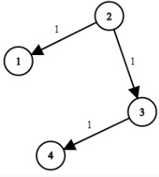
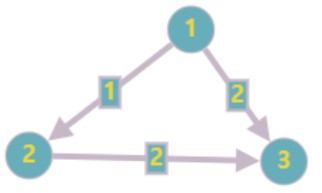

# 최단 경로

- [최단 경로](#최단-경로)
  - [이론](#이론)
    - [다익스트라 알고리즘](#다익스트라-알고리즘)
  - [문제 풀이 리스트](#문제-풀이-리스트)
    - [문제 회고](#문제-회고)
    - [문제 풀이](#문제-풀이)
    - [문제 회고](#문제-회고-1)
    - [문제 풀이](#문제-풀이-1)
  - [참고 문헌](#참고-문헌)

## 이론

 

다음 예시 사진을 구현해보았다.

그래프는 인접 행렬을 사용하였다.

    {
      'A': [0, 4, 1, Infinity, Infinity],
      'B': [Infinity, 0, Infinity, Infinity, 4],
      'C': [Infinity, 2, 0, 4, Infinity],
      'D': [Infinity, Infinity, Infinity, 0, 4],
      'E': [Infinity, Infinity, Infinity, Infinity, 0]
    }

하나의 루프는 다음과 같은 과정이 이뤄진다.

1. 현재 정점은 미방문 정점 중 출발점으로부터 현재까지 계산된 최단 거리를 가지는 정점을 찾는다.
2. 현재 정점에서 이웃한 정점의 최단 거리를 갱신한다.

알고리즘에 목표 정점은 주어지지 않는다. 

- BFS 기반으로 모든 정점을 순회해야하기 때문이다.

- 최단 경로는 알고리즘에 사용된 자료구조에서 도출한다.

최단 경로 알고리즘은 대표적으로 2가지가 있다.

### 다익스트라 알고리즘

- `3개의 고정 배열`로 구현

  - 시작 정점에서 모든 정점까지 최단 경로를 저장하는 배열.

        distances = [ 0, 3, 1, 5, 7 ] 

  - 방문한 정점을 기억하는 배열.

        visited = [ true, true, true, true, true ]            
      
    > 이 자료구조를 큐로 대체할 수 있다.

  - 바로 이전 정점을 저장하는 배열.

    이전 정점을 따라 시작 정점까지 가면 거쳐온 정점을 파악할 수 있다.

        parents = [ 'A', 'C', undefined, 'C', 'B' ]  

  동작과정은 [링크](https://slides.com/kimyongki/deck-2a92f9/fullscreen)에서 확인하자.

- `우선순위 큐`로 구현

  앞서 1번의 과정은 모든 정점 갯수만큼 탐색해야한다.
  
  이 과정을 줄일 수 있다.

## 문제 풀이 리스트

743. Network Delay Time
  <a href="https://leetcode.com/problems/network-delay-time/">👊</a>

### 문제 회고

**첫번째 시행착오**

`Example1`의 그림을 보고 DFS라고 판단하였다.

시작 정점으로 부터 가장 깊은 정점 까지의 경로를 더하는 것이 결과값이기 때문이다.

다만, 다음과 같은 테스트 케이스가 있었다.

내가 접근한 DFS는 이동할 정점을 선정 기준에 가중치를 고려하지 않았다.

이 부분에서 BFS기반의 다익스트라 알고리즘으로 접근이 필요함을 느꼈다.

또한, BFS기반이라 최단거리의 노드를 찾아도 **모든 노드는 탐색해야한다는 점**을 알게되었다.

**두번째 시행착오**

다익스트라 알고리즘을 사용하되, `Example1`의 그림을 보고 최장거리를 구하는 것으로 착각하였다.

단순히 **먼 노드의 최단거리**를 구하는 것이었다.

**해결점**

이외에도 `3개의 고정배열을 사용한 다익스트라 구현`은 코드를 참고해도 여럿 테스트케이스에서 막히는 이슈가 있었다.

가독성이 좋은 `우선순위 큐를 사용한 다익스트라 구현` 코드를 참조해서 해결할 수 있었다.

### 문제 풀이

> `src\743.js`에서 확인할 수 있다.

787. Cheapest Flights Within K Stops
  <a href="https://leetcode.com/problems/cheapest-flights-within-k-stops/">👊</a>

### 문제 회고

전형적인 `우선순위 큐를 사용한 다익스트라`로는 해결할 수 없는 문제다.

stops라는 priority보다 높은 우선순위가 존재하기 때문이다.

다만, 큐의 front가 dst를 만날때까지 순회한다의 틀은 변한 것없으니

큐에 넣는 구조체에 stops를 추가한 뒤, 이에 맞는 조건만 넣어줌으로써 해결할 수 있었다.

`Time Limit Exceeded` 에러가 발생해 그래프의 구현체를 인접 리스트로 바꿨지만 동일하였다.

때문에 `힙 기반 우선순위 큐를 사용한 다익스트라`의 필요성을 느꼈다.

### 문제 풀이

> `src\787.js`에서 확인할 수 있다.

## 참고 문헌

[Dijkstra 구현](https://levelup.gitconnected.com/finding-the-shortest-path-in-javascript-dijkstras-algorithm-8d16451eea34) ━ *Level Up Coding*

[Dijkstra 구현 (우선순위 큐 ver)](https://leetcode.com/problems/network-delay-time/discuss/863787/Javascript-Using-Dijikstra-Algorithm-and-Priority-Queue-(faster-than-88.14-of-js-submissions)) ━ *LeetCode*

[Dijkstra 이론](https://namu.wiki/w/다익스트라%20알고리즘) ━ *Namu Wiki*

[Math.max with undefined](https://stackoverflow.com/questions/12957405/math-max-and-math-min-nan-on-undefined-entry) ━ *StackOverflow*

[Simple Solution at 787. Cheapest Flights Within K Stops](https://leetcode.com/problems/cheapest-flights-within-k-stops/discuss/181943/Readable-Javascript-Solution) ━ *LeetCode*