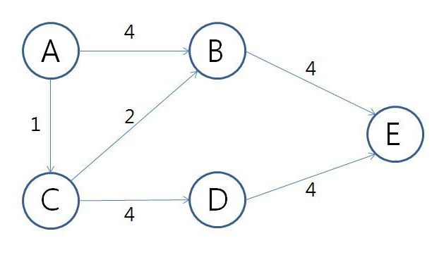

# 최단 경로

- [최단 경로](#최단-경로)
  - [이론](#이론)
  - [참고 문헌](#참고-문헌)

## 이론

 

다음 예시 사진을 구현해보았다.

그래프는 인접 행렬을 사용하였다.

    {
      'A': [0, 4, 1, Infinity, Infinity],
      'B': [Infinity, 0, Infinity, Infinity, 4],
      'C': [Infinity, 2, 0, 4, Infinity],
      'D': [Infinity, Infinity, Infinity, 0, 4],
      'E': [Infinity, Infinity, Infinity, Infinity, 0]
    }

그래프에서 A를 시작 정점으로 E를 목표 정점이라고 하였을 때,

최단 경로 알고리즘은 대표적으로 2가지가 있다.

- 다익스트라 알고리즘    

    1. 3가지 배열 자료구조가 필요하다.

        - 시작 정점에서 모든 정점까지 최단 경로를 저장하는 배열.

              distances = [ 0, 3, 1, 5, 7 ] 

        - 방문한 정점을 기억하는 배열.

              visited = [ true, true, true, true, true ]

        - 바로 이전 정점을 저장하는 배열.

          이전 정점을 따라 시작 정점까지 가면 거쳐온 정점을 파악할 수 있다.

              parents = [ 'A', 'C', undefined, 'C', 'B' ]

    2. 루프를 돌면서, 간선의 가중치에 따라 최단 경로가 되는 정점을 갱신한다.

- 플로이드 알고리즘      
  
    1. 인접 행렬을 3중 반복 하는 루프로 구성된다.
    2. 지금까지 알고 있던 최단 경로에서 정점 `i → j`
    3. k를 거치는 것이 (정점 `i → k → j`) 최단 경로라면, 인접 행렬의 값을 바꿔준다.

## 참고 문헌

[Dijkstra 구현](https://levelup.gitconnected.com/finding-the-shortest-path-in-javascript-dijkstras-algorithm-8d16451eea34) ━ *Level Up Coding*