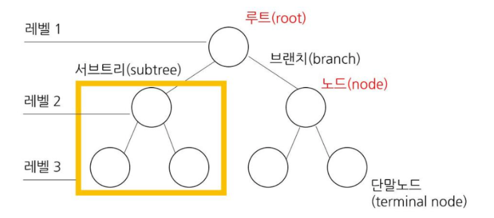
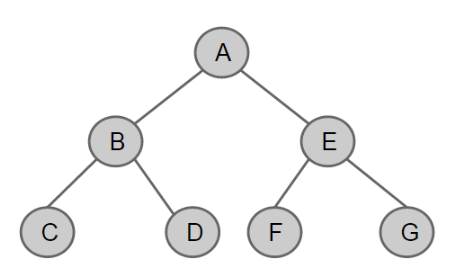
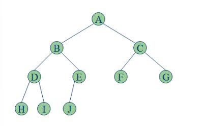

# Tree

## 목차
- 트리의 용어
- 트리의 시간복잡도
- 트리의 활용
- Binary Tree
  - 정 이진 트리(Full Binary Tree)
  - 포화 이진 트리(Perfect Binary Tree)
  - 완전 이진 트리(Complete Binary Tree)
- 트리의 순회

## 트리의 용어

- 트리 : 무방향이면서 사이클이 없는 연결그래프
- 루트 노드 : 가장 상위 노드를 루트노드라고 한다.
- 부모 노드 : 부모-자식 관계에서 상위 계층의 노드
- 자식 노드 : 부모-자식 관계에서 하위 계층의 노드
- 형제 노드 : 부모가 동일한 노드
- 서브트리 : 전체 트리 내에서 작게 나눠서 보면 또 따른 서브 트리라고 볼 수 있다.
- 노드 : 트리의 구성요소
- 단말 노드 : 자식 노드가 없는 노드
- 깊이 : 루트 노드에서 해당 노드까지 도달하는데 사용하는 간선의 수
  - 루트 노드의 깊이는 0
- 레벨 : 노드의 깊이 + 1
- 높이 : 루트 노드에서 해당 노드까지 도달하는데 지나간 정점의 개수
  - 트리에 차수 : 해당 트리 내 모든 노드의 높이 중 최댓값
- 노드의 차수 : 노드의 자식 수
  - 트리에 차수 : 해당 트리 내 모든 노드의 차수 중 최댓값

## 트리의 시간복잡도
- 노드 삽입 : O(1)
- 노드 삭제 : O(1)
- 노드 검색 : O(N)

## 트리의 활용
- HTML DOM 트리
- 파일 시스템
- DBMS
- 검색 엔진
- 트라이 알고리즘

## Binary Tree
> 트리의 차수가 2 이하인 트리

- 비선형 자료구조
- 자식이 최대 2개이기 때문에 자식을 왼쪽 자식과 오른쪽 자식으로 구분
- 높이가 `N`인 이진 트리의 최대 노드 갯수는 2^N -1 개이다.

### 정 이진 트리(Full Binary Tree)
> 모든 노드의 차수가 0 또는 2인 이진 트리

### 포화 이진 트리(Perfect Binary Tree)
> 정 이진 트리에서 단말 노드 제외 모든 노드가 두 개의 자식 노드를 가지고 모든 노드의 동일한 깊이 또는 레벨을 가지는 트리

### 완전 이진 트리(Complete Binary Tree)
> 마지막 레벨을 제외하고 모든 레벨이 완전히 채워져 있고 마지막 레벨의 모든 노드는 가능한 가장 왼쪽에 있는 트리

## 트리의 순회

1. 전위 순회(Pre-order) : 현재 노드 방문 -> 왼쪽 자식 탐색 -> 오른쪽 자식 탐색
2. 중위 순회(In-order) : 왼쪽 자식 탐색 -> 현재 노드 방문 -> 오른쪽 자식 탐색
3. 후위 순회(Post-order) : 왼쪽 자식 탐색 -> 오른쪽 자식 탐색 -> 현재노드 방문
