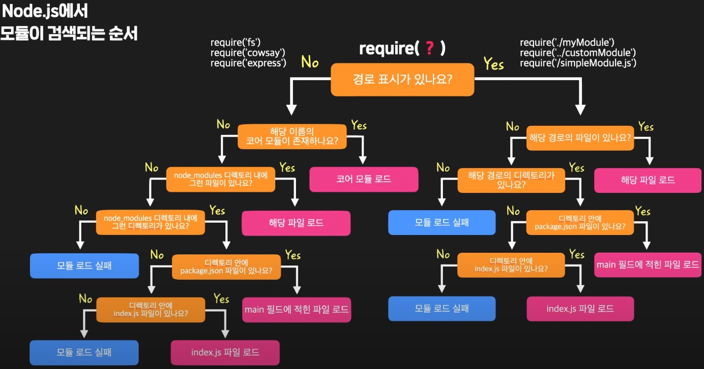
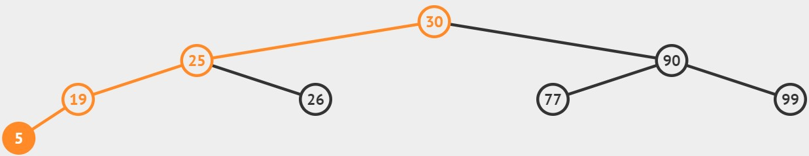
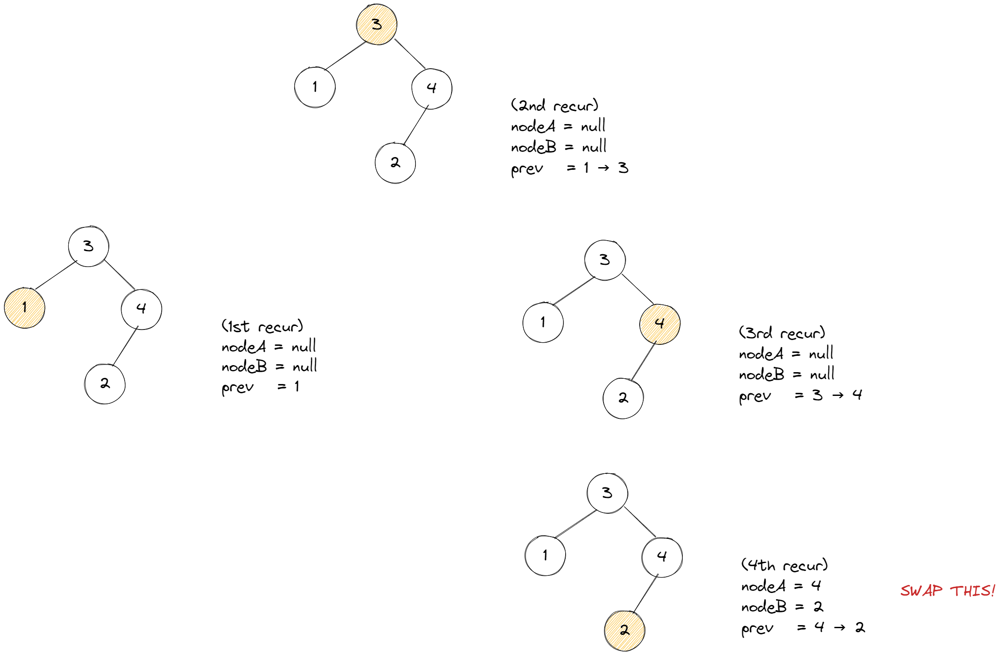
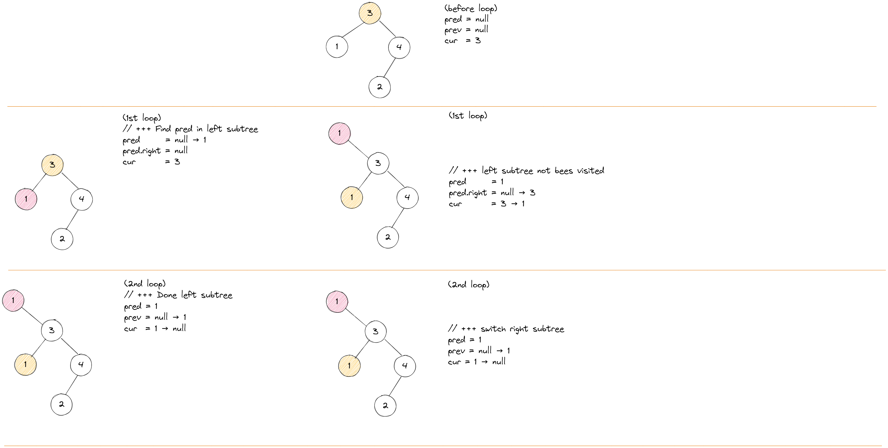
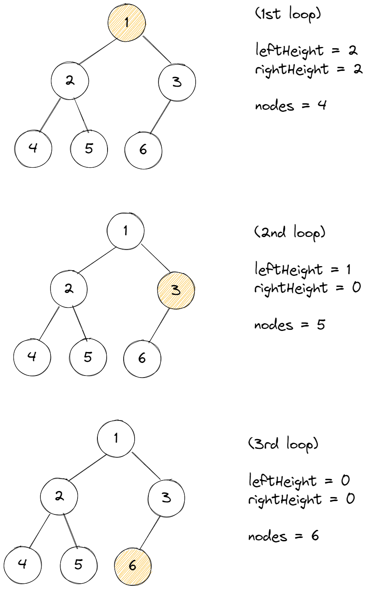

# 트리

## 이론

<details>
<summary>트리 종류</summary>
<br/>

트리란

    계층적인 관계를 가진 자료의 표현에 사용하는 자료구조이다.

일반 트리는

    노드가 임의의 개수의 자식을 가질 수 있는 트리이다.    

    노드마다 링크의 수가 다르기 때문에 복잡하다.

이진 트리는

    노드가 최대 2개의 자식만 가지도록 제한한다.

포화 이진 트리는

    각 레벨에 노드가 꽉 차있는 이진 트리이다.

    따라서 노드에 순서대로 번호를 붙일 수 있다.

완전 이진 트리는

    포화 이진 트리와 유사하지만, 마지막 레벨의 노드는 비어있어도 된다.

</details>

<details>
<summary>이진 트리 표현</summary>

### 배열 표현

포화 이진 트리와 완전 이진 트리에 가장 적합하다.

배열 항목 사이에 빈칸이 발생하지 않기 때문이다.

    이와 반대로, 경사 이진 트리는 빈칸이 많이 발생한다.

어떤 노드의 인덱스를 알면 

    부모 인덱스 =             i / 2

    왼쪽 자식 인덱스 =        2i

    오른쪽 자식 인덱스 =      2i + 1  알 수 있다.

### 링크 표현

두개의 링크를 담는 구조체를 활용한다.

```js
var TreeNode = function (value, left, right) {
  this.value;
  this.left;
  this.right;
}
```
> 이번 주제의 구현 문제는 모두 링크 표현으로 진행한다.

</details>

<details>
<summary>사용 사례</summary>
<br/>

Node.js의 패키지 의존성이 직관적으로 떠올랐다.

Node.js는 패키지가 어딨는지 알지 못해 패키지의 모듈이 필요 할 때, 매번 `readdir` 시스템 콜을 날려 탐색한다.

이때 아래와 같은 탐색 알고리즘을 사용한다.

<div align="center"></div>

`node_modules 폴더`에는 의존성이 동기화된 패키지만 설치된다.

즉, 같은 이름인 패키지의 다른 버전의 모듈들이 설치되지 않는다.

어떻게 동기화했을까?

다음은 최상위 경로인 프로젝트에서 명시한 `package.json`이다.

```json
  "dependencies": {        
    "body-parser": "^1.19.0",
    ...
  }
```

실제 설치는 다른 패키지의 버전이 설치되었다.

`body-parser`를 의존하는 `express`패키지의 버전이 더 major 하기 때문이다.

```shell
├─┬ body-parser@1.19.2
├─┬ express@4.17.3
│ ├── body-parser@1.19.2 deduped
```

어떤 패키지가 의존하는 패키지는 각 패키지의 `package.json`에 명시된다.

패키지 간의 의존성을 `package.json`에 명시된 패키지를 트리의 노드로 생각하여 의존성 트리가 구성되었다고 생각하자.

<div align="center"></div>

현재 설치된 `body-parser`와 다른 버전을 설치한다고 했을 때, 

트리에서 `body-parser`노드를 찾아 버전을 확인한뒤, 동기화를 맞춘다.

</details>

## 구현

<details>
<br/>

<div align="center"></div>

필수메소드와 빅오는 다음과 같다.

- time(worst)는 이진 트리에 적용되고,

- time(avg)는 완전 이진 트리에 적용된다.

|             |  `insert`  |  `delete`  | `_getMinValueAtRightSubtree` |
| :---------: | :--------: | :--------: | :--------------------------: |
| time(worst) |   `O(n)`   |   `O(n)`   |            `O(n)`            |
|  time(avg)  | `O(log n)` | `O(log n)` |            `O(n)`            |
|    space    |   `O(1)`   |   `O(1)`   |            `O(1)`            |

`delete` 메소드 같은 경우 까다로운 경우가 있다.

예로, 90을 삭제했을 때, 해당 노드로 올라올 계승자를 선정해야한다.

이 부분을 우측 서브트리에서 찾는다. (`_getMinValueAtRightSubtree`)

```js
BinarySearchTree.prototype._deleteAtNode = function (node, deleteValue) {
  // +++ node.value === deleteValue
  else {
    ...
    // +++ left, right all exist
    node.value = this._getMinValueAtRightSubtree(node.right);
    node.right = this._deleteAtNode(node.right, node.value);
  }

  return node;
}
```
```js
BinarySearchTree.prototype._getMinValueAtRightSubtree = function (node) {
  let min = node.value;

  while (node.left) {
    min = node.left.value;
    node = node.left;
  }

  return min;
}
```

트리 순회 관련 메소드와 빅오는 다음과 같다.

- `n`은 트리의 모든 노드의 수를 의미한다.
- `L`은 트리의 level 수를 의미한다.

|       | `display` | `inorder` | `preorder` | `postorder` | `levelorder` |
| :---: | :-------: | :-------: | :--------: | :---------: | :----------: |
| time  |  `O(n)`   |  `O(n)`   |   `O(n)`   |   `O(n)`    |    `O(n)`    |
| space |  `O(n)`   |  `O(n)`   |   `O(n)`   |   `O(n)`    |    `O(nL)`    |

</details>

## 이월된 문제 리스트

> 입력값으로 주어진 이진 트리는 이진 탐색 트리가 아니라서 별도의  에디터에서 그대로 구현하기 어려웠다.
>
> 따라서, 별도의 문제 파일로 빼지 못하고, 문제 에디터에서 바로 해결하였다.
>
> 단, 문제에서 사용되는 자료구조는 ADT를 활용하였다.

**[조건: DFS 풀이]**

두 문제는 BFS로 밖에 풀수 없는 유형이다.

다음 예로 `112번` 문제의 그림을 보면 DFS에서 스택을 사용할 뿐 

넓이 우선 탐색을 하기 때문에 DFS라고 볼 수 없다.

<div align="center"></div>

<details>
<summary>112. Path Sum
  <a href="https://leetcode.com/problems/path-sum/">👊</a>
</summary>

### 문제 풀이 [`#Iterative BFS`]

```js
/**
 * @param {TreeNode} root
 * @param {number} targetSum
 * @return {boolean}
 * 
 * w as width
 *
 * time:    O(n)
 * space:   O(w)
 */
var hasPathSum = function (root, targetSum) {
  if (!root)
    return false;

  const stack = new Stack();
  stack.push({ 'node': root, 'remainValue': targetSum });

  while (!stack.isEmpty()) {
    const { node, remainValue } = stack.pop();

    if (
      !node.left
      && !node.right
      && node.val === remainValue
    )
      return true;

    if (node.left)
      stack.push({ 'node': node.left, 'remainValue': remainValue - node.val });

    if (node.right)
      stack.push({ 'node': node.right, 'remainValue': remainValue - node.val });
  }
  return false;
};
```

</details>

<details>
<summary>257. Binary Tree Paths
  <a href="https://leetcode.com/problems/binary-tree-paths/">👊</a>
</summary>

### 문제 풀이 [`#Iterative BFS`]

```js
/**
 * @param {TreeNode} root
 * @return {string[]}
 *  
 * w as width
 * 
 * time:    O(n)
 * space:   O(w)
 */
var binaryTreePaths = function (root) {
  const result = [];

  const stack = new Stack();
  stack.push({ 'node': root, 'path': String(root.val) });

  while (!stack.isEmpty()) {    
    const { node, path } = stack.pop();

    if (
      !node.left
      && !node.right
    )
      result.push(path);

    if (node.left)
      stack.push({
        'node': node.left, 'path': `${path}->${String(node.left.val)}`
      });

    if (node.right)
      stack.push({
        'node': node.right, 'path': `${path}->${String(node.right.val)}`
      });
  }
  return result;
};
```

</details>
<br/>

**[조건: BFS 풀이]**

<details>
<summary>104. Maximum Depth of Binary Tree
  <a href="https://leetcode.com/problems/maximum-depth-of-binary-tree/">👊</a>
</summary>

### 문제 풀이 1/2 (`#Recursive BFS`)

직관적으로 떠오른 풀이다.

함수를 노드의 자식을 발견할 때마다 

깊이를 1 더한 매개변수와 함께 재귀적 호출한다.

리턴된 값들에서 최댓값이 결과값이다.

```js
var getMaxDepth = function(node, level){
  let curDepth = level;
  let left = 1;
  let right = 1;
  
  if(!node)
    return curDepth;
  
  if(node.left)
    left = getMaxDepth(node.left, level + 1);

  if(node.right)
    right = getMaxDepth(node.right, level + 1);  
  
  return Math.max(curDepth, left, right);
}

/**
 * @param {TreeNode} root
 * @return {number}
 * 
 * 
 * time:    O(n)
 * space:   O(w)
 */
var maxDepth = function(root) {
  if(!root)
    return 0;
    
  return getMaxDepth(root, 1);
};
```

### 문제 풀이 2/2 (`#Iterative BFS`)

```js
/**
 * @param {TreeNode} root
 * @return {number}
 * 
 * time:    O(n)
 * space:   O(w)
 */
var maxDepth = function(root) {
  if(!root)
    return 0;
  
  let result = 1;
  
  const queue = new Queue();
  queue.enQueue({'node': root, 'depth': 1});
  
  while(!queue.isEmpty()){
    const {node, depth} =  queue.Front();        
    
    if(!node)
      continue;
    
    if(!node.left && !node.right)
      result = Math.max(result, depth);
    
    if (node.left)
      queue.enQueue({'node': node.left, 'depth': depth + 1});
    
    if (node.right)
      queue.enQueue({'node': node.right, 'depth': depth + 1});
    
    queue.deQueue();
  }
  
  return result;
};
```
</details>

<details>
<summary>101. Symmetric Tree
  <a href="https://leetcode.com/problems/symmetric-tree/submissions/">👊</a>
</summary>

### 문제 회고

구현해놓은 순회 메소드 중 `inorder`를 좌측, 우측 버전으로 변형한 뒤,

각 순회 결과 리스트를 비교하면 된다 생각했다.

이는 공간 복잡도가 생기고,

`null`을 체크하지 못해 각 순회 결과는 동일하되 대칭은 아닌 테스트케이스를 통과하지 못했다.

    Input:  [1,2,2,null,3,null,3]
    Output: false

### 문제 풀이 1/2 [`#Recursive BFS`]

```js
/**
 * @param {TreeNode} root
 * @return {boolean}
 * 
 * time:    O(n)
 * space:   O(w)
 */
var isSymmetric = function(root) {
  if(!root)
    return true;
  
  return isMirror(root.left, root.right);
};

var isMirror = function(nodeA, nodeB){
  if(!nodeA && !nodeB)
    return true;
  
  if(!nodeA || !nodeB)
    return false;
  
  if(nodeA.val != nodeB.val)
    return false;
  
  return isMirror(nodeA.right, nodeB.left)
      && isMirror(nodeA.left, nodeB.right);
}
```

### 문제 풀이 2/2 [`#Iterative BFS`]

```js
/**
 * @param {TreeNode} root
 * @return {boolean} 
 * 
 * time:    O(n)
 * space:   O(w)
 */
var isSymmetric = function(root) {
  if(!root)
    return true;
  
  const queue = new Queue();
  
  queue.enQueue(root.left);
  queue.enQueue(root.right);
  
  while(!queue.isEmpty()){    
    const nodeA = queue.poll();
    const nodeB = queue.poll();
    
    if(!nodeA && !nodeB)
      continue;
    
    if(!nodeA || !nodeB)
      return false;
    
    if(nodeA.val !== nodeB.val)
      return false;
        
    queue.enQueue(nodeA.left);
    queue.enQueue(nodeB.right);

    queue.enQueue(nodeA.right);
    queue.enQueue(nodeB.left);     
  }
  
  return true;
};
```
</details>

## 문제 리스트

<details>
<summary>99. Recover Binary Search Tree
  <a href="https://leetcode.com/problems/recover-binary-search-tree/">👊</a>
</summary>

### 문제 회고

링크 표현에서 swap을 해야해서 접근하기 어려웠던 문제였다.

### 문제 풀이 1/3 [`#Recursive Inorder` `#BFS` `#space O(n)`]

참고한 코드는 inorder의 순회를 활용하였다.

정상적인 이진 탐색 트리는 inorder시, 오름차순이 유지된다.

따라서 오름차순 유지가 되지 않은 노드들을 기억하면된다.

트리를 순회할 때마다 

이전 순회한 노드를 기억하면서 swap 대상이 되는 노드A와 노드B를 도출한다.

<table>
  <tr>
    <td>
      <div align="center">
        
      </div>
    </td>
    <td>
<p>

```js
/**
 * @param {TreeNode} root
 * @return {void} Do not return anything, modify root in-place instead.
 *
 * time:    O(n)
 * space:   O(w)
 */
var recoverTree = function(root) {  
  let nodeA = null;
  let nodeB = null;
  let prevNode = null;
  
  function swap(nodeA, nodeB){
    let temp = nodeA.val;
    nodeA.val = nodeB.val;
    nodeB.val = temp;
  }
  
  function inorderWithMemory(node) {
    if(!node)
      return;    
    
    inorderWithMemory(node.left);
    
    if(!nodeA && (!prevNode || prevNode.val >= node.val))
      nodeA = prevNode;
    
    if(nodeA && prevNode.val >= node.val)
      nodeB = node;    
    
    prevNode = node;    
    
    inorderWithMemory(node.right);     
  }
  
  inorderWithMemory(root);  
  swap(nodeA, nodeB);
};
```
</p>
    </td>
  </tr>
</table>


### 문제 풀이 2/3 [`#Iterative Inorder` `#DFS` `#space O(n)`]

<table>
  <tr>
    <td>
      <div align="center">
        
      </div>
    </td>
    <td>
<p>

```js
/**
 * @param {TreeNode} root
 * @return {void} Do not return anything, modify root in-place instead.
 *
 * time:    O(n)
 * space:   O(h)
 */
var recoverTree = function(root) {    
  let nodeA = null;
  let nodeB = null;
  
  function swap(nodeA, nodeB){
    let temp = nodeA.val;
    nodeA.val = nodeB.val;
    nodeB.val = temp;
  }
  
  let cur = root;
  let prev = null;
  const stack = new Stack();
  
  while(!stack.isEmpty() || cur){
    if(cur){          // +++ visit cur's left subtree
      stack.push(cur);
      cur = cur.left;
    }else{            // +++ cur's left subtree is done
      cur = stack.pop();
      
      if(prev && cur.val <= prev.val){
        if(!nodeA)
          nodeA = prev;
        
        nodeB = cur;
      }
      
      // +++ visit cur's right subtree
      prev = cur;
      cur = cur.right;
    }
  }
  
  swap(nodeA, nodeB);
};
```
</p>
    </td>
  </tr>
</table>

### 문제 풀이 3/3 [`#Non-recursive Inorder` `#space O(1)`]

`Non-recursive Inorder`은  `Morris traversal` 알고리즘이라고 한다.

간단히 설명하면,

    1. cur를 root로 초기화한다.
    2. cur이 null이 아니면, cur에 왼쪽 자식이 있는지 탐색한다.
    3. cur에 왼쪽 자식이 없으면 cur의 오른쪽 노드를 가리키도록 바꾼다.
       또는,  cur를 cur의 왼쪽 하위 트리에서 가장 큰 노드로 바꾼다.    

<table>
  <tr>
    <td>
      <div align="center">
        
      </div>
    </td>
    <td>
<p>

```js
/**
 * @param {TreeNode} root
 * @return {void} Do not return anything, modify root in-place instead.
 * 
 * time:    O(n)
 * space:   O(1)
 */
var recoverTree = function(root) {
  let nodeA = null;
  let nodeB = null;
  
  function swap(nodeA, nodeB){
    let temp = nodeA.val;
    nodeA.val = nodeB.val;
    nodeB.val = temp;
  }
    
  let pred = null;
  let prev = null;  
  let cur = root;
  
  while(cur){
    // +++ Recover
    if(prev && cur.val <= prev.val){
      if(!nodeA)
        nodeA = prev;
      
      nodeB = cur;
    }
        
    if(!cur.left){
      prev = cur;
      cur = cur.right;
    }else{
      // +++ Find pred in left subtree
      pred = cur.left;
      
      while(pred.right && pred.right != cur)
        pred = pred.right;
      
      // +++ Make cur as right child of its prev
      if(pred.right != cur){
        pred.right = cur;
        cur = cur.left;
      }     
      // +++ Fix right child of prev
      else{        
        prev.right = null;
        prev = cur;
        cur = cur.right;
      }            
    }
  }
  
  swap(nodeA, nodeB);
};
```
</p>
  </tr>
</table>

</details>

<details> 
<summary>222. Count Complete Tree Nodes
  <a href="https://leetcode.com/problems/count-complete-tree-nodes/">👊</a>
</summary>

### 문제 회고

처음 접근 방법은 BFS하는 것이었다.

단, 시간복잡도가 `O(n)`이 나온다.

문제가 `medium`인 이유는 이 시간복잡도를 `O(n)`보다 적게 나오게 하는 것이다.

### 문제 풀이 1/2 [🤔 `#time O(log n²)` `#Recursive`]

<table>
  <tr>
    <td>
      
    </td>
    <td>
<p>

```js
/**
 * @param {TreeNode} root
 * @return {number}
 *
 * time:  O(log n²)
 *        → recursive   O(log n)
 *        → getHeight   O(log n) 
 * space: O(n)
 */
var countNodes = function(root) {    
  if(!root)
    return 0;  
    
  const leftHeight = getLeftHeight(root);
  const rightHeight = getRightHeight(root); 

  if(leftHeight === rightHeight)
    return (1 << leftHeight) - 1;
    
  return countNodes(root.left) + countNodes(root.right) + 1;
};

/**
 * @param {TreeNode} root
 * @return {number}
 *
 * time:  O(log n)
 * space: O(1)
 */
var getLeftHeight = function(node) {
  return node ? getLeftHeight(node.left) + 1 : 0;
};

var getRightHeight = function(node) {
  return node ? getRightHeight(node.right) + 1 : 0;
};

```
</p>
    </td>
  </tr>
</table>

### 문제 풀이 2/2 [`#time O(log n²)` `#Iterative`]

<table>
  <tr>
    <td>      
    </td>
    <td>
<p>

```js
/**
 * @param {TreeNode} root
 * @return {number}
 *
 * time:  O(log n²)
 * space: O(1)
 */
var countNodes = function(root) {  
  if(!root)
    return 0;
    
  let nodes = 0;  
  
  while(root){         
    const leftHeight = getHeight(root.left);
    const rightHeight = getHeight(root.right); 
    
    if(leftHeight === rightHeight){
      nodes += (1 << leftHeight);
      root = root.right;
    }else{
      nodes += (1 << leftHeight) - 1;
      root = root.left;
    }    
        
    console.log(leftHeight, rightHeight);
    console.log("NODES:", nodes);
  }
  
  return nodes;
};

/**
 * @param {TreeNode} root
 * @return {number}
 *
 * time:  O(log n)
 * space: O(1)
 */
var getHeight = function(root) {
  return root ? getHeight(root.left) + 1 : 0;
};
```
</p>
    </td>
  </tr>
</table>
</details>

<hr/>

## 참고 문헌

<details>
<summary>자료구조 이론 및 구현</summary>
<br/>

[트리 이론](https://namu.wiki/w/트리(그래프)#s-4.1.1) ━ *나무위키*

[Node.js의 모듈 검색 알고리즘 예시 사진](https://www.youtube.com/watch?v=EncMFNfuBw0&list=PLYpU5pCXtxyhLiu0YoBeQq_SSQg8BA2-C&index=5&ab_channel=온라인코딩스쿨코드잇) ━ *코드잇*

[`package-lock.json` 역할](https://junwoo45.github.io/2019-10-02-package-lock/) ━ *박준우 블로그*

[이진 탐색 트리 `delete 메소드` 구현](https://www.geeksforgeeks.org/binary-search-tree-set-2-delete/) ━ *GeeksforGeeks*

[이진 트리 DFS vs BFS](https://www.geeksforgeeks.org/bfs-vs-dfs-binary-tree/) ━ *GeeksforGeeks*

[What is Morris traversal?](https://www.educative.io/edpresso/what-is-morris-traversal) ━ *educative*
</details>

<details>
<summary>풀이 참고</summary>
<br/>

[Simple Solution at 112. Path Sum](https://leetcode.com/problems/path-sum/discuss/36581/My-Python-iterative-DFS-solution) ━ *LeetCode*

[Simple Solution at 101. Symmetric Tree](https://leetcode.com/problems/symmetric-tree/discuss/433170/isMirror-DFS-(Recursion-OneTwo-Stacks)-%2B-BFS-(Queue)-Solution-in-Java) ━ *LeetCode*

[Simple Solution at 99. Recover Binary Search Tree](https://leetcode.com/problems/recover-binary-search-tree/discuss/32562/Share-my-solutions-and-detailed-explanation-with-recursiveiterative-in-order-traversal-and-Morris-traversal) ━ *LeetCode*

[Simple Solution at 222. Count Complete Tree Nodes](https://leetcode.com/problems/count-complete-tree-nodes/discuss/61958/Concise-Java-solutions-O(log(n)2)) ━ *LeetCode*

[Simple Solution at 222. Count Complete Tree Nodes](https://www.youtube.com/watch?v=4wPlA_InnGY&ab_channel=CodingBeats) ━ *CodingBeats*
</details>
