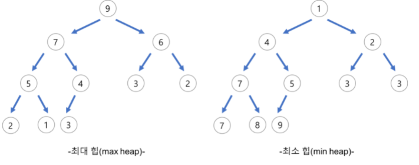
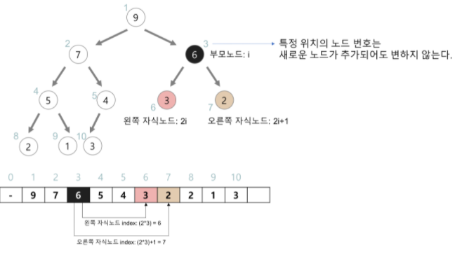
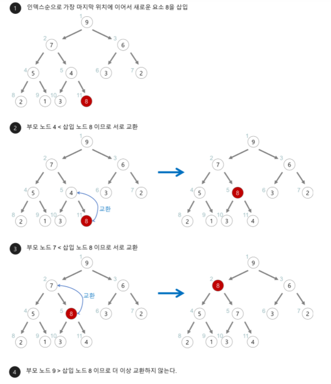
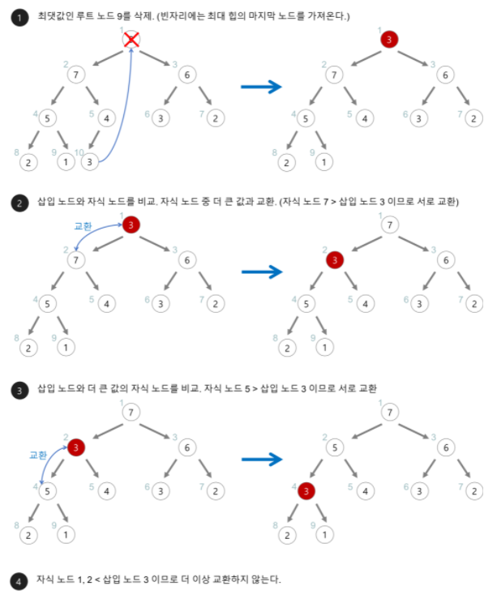

# Heap

## 자료구조 Heap이란?
- **완전 이진 트리의 일종**으로 우선순위 큐를 위하여 만들어진 자료구조
- **여러 개의 값들 중에서 최대값이나 최솟값을 빠르게 찾아내도록 만들어진 자료구조이다.**
- 힙은 형제노드 간의 우선순위를 고려하지 않고 부모 노드와 자식 노드의 키 값만 고려한다. 이러한 정렬 상태를 **반정렬 상태** 혹은 **느슨한 정렬 상태** 또는 **약한 힙**이라고 불린다.
- 힙 트리에서는 중복된 값을 허용한다.

## Heap의 종류
- 최대 힙(max heap)
  - 부모 노드의 키값이 자식 노드의 키 값보다 크거나 같은 완전 이진 트리
  - key(부모 노드) >= key(자식 노드)
- 최소 힙(min heap)
  - 부모 노드의 키 값이 자삭 노드의 키 값보다 작거나 같은 완전 이진 트리
  - key(부모 노드) <= key(자식 노드)

## Heap의 구현
- 힙을 저장하는 표준적인 자료구조는 **배열**이다.
- 구현을 쉽게 하기 위하여 배열의 첫 번째 인덱스인 0은 사용되지 않는다. = 시작 인덱스(root)는 1부터 시작한다.
- 특정 위치의 노드 번호(인덱스)는 새로운 노드가 추가되어도 변하지 않는다.(불변)
  - 예를 들어 루트 노드의 오른쪽 노드의 번호는 항상 3이다.
- 배열 힙의 성질
  1. 왼쪽 자식 노드 인덱스 = 부모 노드의 인덱스 * 2
  2. 오른쪽 자식의 노드 인덱스 = 부모 노드의 인덱스 * 2 + 1
  3. 부모 노드의 인덱스 = 자식 노드 인덱스 / 2

## Heap의 삽입
1. 힙에 새로운 요소가 들어오면, 일단 새로운 노드를 힙의 마지막 노드에 이어서 삽입힌다.
2. 새로운 노드를 부모 노드들과 교환해서 힙의 성질을 만족시킨다.

ex) 아래의 최대 힙에 새로운 요소 8을 삽입 해보자

## Heap의 삭제
1. 최대 힙에서 최댓값이 루트 노드이므로 루트 노드가 삭제된다.
   - 최대 힙에서 삭제 연산은 최대값을 가진 요소를 삭제하는 것이다.
2. 삭제된 루트 노드에서 힙의 마지막 노드를 가져온다.
3. 힙을 재구성한다.

ex) 아래의 최대 힙에서 최대값을 삭제해보자

