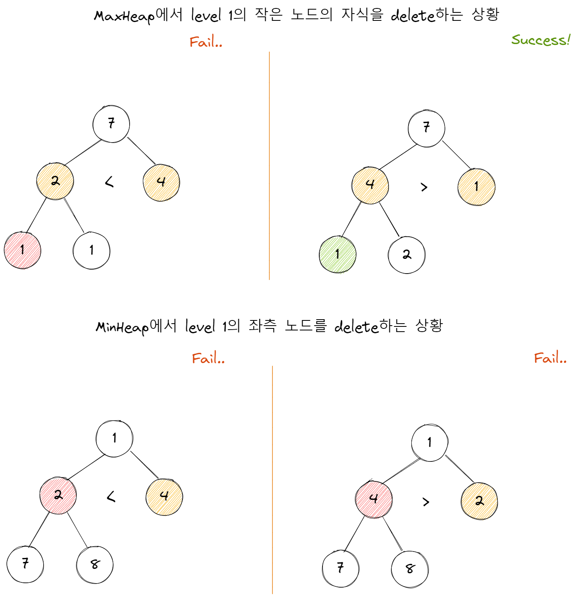

# 힙

## 이론

 

힙은 

    완전 이진 트리 기반의 자료구조다.

적용해볼 사례는

    이전 주차에서 진행했던 다익스트라 알고리즘의 
    
    time을 O(V²)에서 O(E log V²)으로 줄일 수 있다.

이진 탐색 트리(BST)와 차이점은

|             |                       힙                        |                           BST                            |
| :---------: | :---------------------------------------------: | :------------------------------------------------------: |
| 직관적 차이 |                 상/하 관계 보장                 |                     좌/우 관계 보장                      |
|    풀이     | 우측의 노드가 좌측의 노드보다 작은 경우가 있다. | 부모는 왼쪽 자식보다 크고 오른쪽 자식보다는 작거나 같다. |
|    정렬     |                        X                        |                            O                             |
|    장점     |           가장 작은/큰 값 추출 `O(1)`           |                   탐색/삽입 `O(log n)`                   |

## 구현

필수메소드와 빅오

 

주로 배열로 구현한다.

이때, 여러 매체에서 주로 1번 인덱스부터 사용하는데, 

0번 인덱스부터 사용과 큰 차이는 없다. 필자는 0번 인덱스로 사용하였다.

                      root at 0       root at 1
    Left child        index*2 + 1     index*2
    Right child       index*2 + 2     index*2 + 1
    Parent            (index-1)/2     index/2

<table>
  <tr>
    <th>최대힙</th>
    <th>최소힙</th>
  </tr>
  <tr>
    <td>
      
    </td>
    <td>
      
    </td>
  </tr>
  <tr>
    <td align="center" colspan="2">    
      <table>
        <tr>
          <th></th>
          <th><code>insert</code></th>
          <th><code>extract</code></th>
          <th><code>find</code></th>                 
          <th><code>swap</code></th>
        </tr>
        <tr>
          <td>time</td>
          <td align="center" colspan="3"><code>O(log n)</code></td>          
          <td><code>O(1)</code></td>
        </tr>
        <tr>
          <td>space</td>
          <td align="center" colspan="3"><code>O(1)</code></td>          
          <td><code>O(1)</code></td>
        </tr>
      </table>    
    </td>
  </tr>
  <tr>
    <td>
      <table>
        <tr>
          <th></th>
          <th><code>delete</code></th>
          <th><code>update</code></th>
          <th><code>_bubbleUp</code></th>
          <th><code>_bubbleDown</code></th>   
        </tr>
        <tr>
          <td>time</td>
          <td><code>O(n)</code></td>
          <td align="center" colspan="3"><code>O(log n)</code></td>
        </tr>
        <tr>
          <td>space</td>
          <td><code>O(w)</code></td>
          <td align="center" colspan="3"><code>O(1)</code></td>
        </tr>
      </table>
    </td>
    <td>
      <table>
        <tr>
          <th></th>
          <th><code>delete</code></th>
          <th><code>update</code></th>
          <th><code>_bubbleUp</code></th>
          <th><code>_bubbleDown</code></th>          
        </tr>
        <tr>
          <td>time</td>
          <td><code>O(n)</code></td>
          <td align="center" colspan="3"><code>O(log n)</code></td>
        </tr>
        <tr>
          <td>space</td>
          <td><code>O(w)</code></td>
          <td align="center" colspan="3"><code>O(1)</code></td>
        </tr>
      </table>
    </td>
  </tr>
</table>

테스트 시 발견한 <code>delete</code> 이슈

 

  

이전 우선순위 큐 주제때 이를 이진 탐색 한 뒤 삭제한 코드를 짰었다.

좌우 조건이 없는 힙에는 필요없는 메소드였다.

이를 해결할 방법은 DFS 방법밖에 없다고 생각하였다.

## 참고 문헌

[Why in a heap implemented by array the index 0 is left unused?](https://stackoverflow.com/questions/22900388/why-in-a-heap-implemented-by-array-the-index-0-is-left-unused) ━ *Stack overflow*

[Deleting a node (at a specific location) from a heap](http://www.mathcs.emory.edu/~cheung/Courses/171/Syllabus/9-BinTree/heap-delete.html) ━ *Emory College*
