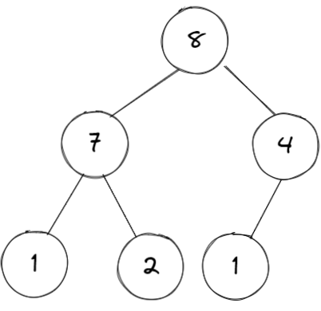
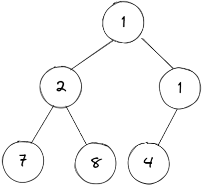

# 힙

## 이론

 

힙은 

    완전 이진 트리 기반의 자료구조다.

    주로 배열로 구현한다.

사용 사례는

    이전 주차에서 진행했던 다익스트라 알고리즘의 
    
    time을 O(V²)에서 O(E log V²)으로 줄일 수 있다.

이진 탐색 트리(BST)와 차이점은

|             |                       힙                        |                           BST                            |
| :---------: | :---------------------------------------------: | :------------------------------------------------------: |
| 직관적 차이 |                 상/하 관계 보장                 |                     좌/우 관계 보장                      |
|    풀이     | 우측의 노드가 좌측의 노드보다 작은 경우가 있다. | 부모는 왼쪽 자식보다 크고 오른쪽 자식보다는 작거나 같다. |
|    정렬     |                        X                        |                            O                             |
|    장점     |           가장 작은/큰 값 추출 `O(1)`           |                   탐색/삽입 `O(log n)`                   |

## 구현

<table>
  <tr>
    <th>최대힙</th>
    <th>최소힙</th>
  </tr>
  <tr>
    <td>
      
    </td>
    <td>
      
    </td>
  </tr>
  <tr>
    <td align="center" colspan="2">    
      <table>
        <tr>
          <th></th>
          <th><code>insert</code></th>
          <th><code>extract</code></th>
          <th><code>delete</code></th>          
          <th><code>find</code></th>
          <th><code>swap</code></th>
        </tr>
        <tr>
          <td>time</td>
          <td align="center" colspan="4"><code>O(log n)</code></td>
          <td><code>O(1)</code></td>
        </tr>
        <tr>
          <td>space</td>
          <td align="center" colspan="4"><code>O(log n)</code></td>
          <td><code>O(1)</code></td>
        </tr>
      </table>    
    </td>
  </tr>
  <tr>
    <td>
      <table>
        <tr>
          <th></th>
          <th><code>update</code></th>
          <th><code>_bubbleUp</code></th>
          <th><code>_bubbleDown</code></th>
          <th><code>_binarySearch</code></th>
        </tr>
        <tr>
          <td>time</td>
          <td align="center" colspan="4"><code>O(log n)</code></td>
        </tr>
        <tr>
          <td>space</td>
          <td align="center" colspan="4"><code>O(1)</code></td>
        </tr>
      </table>
    </td>
    <td>
      <table>
        <tr>
          <th></th>
          <th><code>update</code></th>
          <th><code>_bubbleUp</code></th>
          <th><code>_bubbleDown</code></th>
          <th><code>_binarySearch</code></th>
        </tr>
        <tr>
          <td>time</td>
          <td align="center" colspan="4"><code>O(log n)</code></td>
        </tr>
        <tr>
          <td>space</td>
          <td align="center" colspan="4"><code>O(1)</code></td>
        </tr>
      </table>
    </td>
  </tr>
</table>

