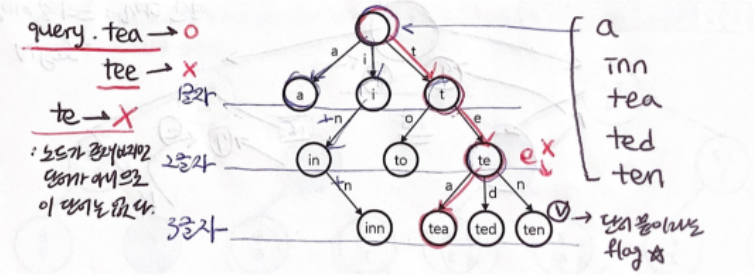

# 트라이(Trie)

## 트라이 개요
Q : 우리가 여러 개의 문자열을 가지고 있을 때, 어떤 문자열이 그 문자열 중 하나인지 알아내는 방법은 무엇이 있을까?
ex) ['abc', 'ab', 'car']가 있을 때 'ab'를 찾는 방법

1. 일일이 비교
   - 배열을 for문 돌면서 문자열 하나씩 검증해야하기 때문에 for문을 한번 더 돌아야 하는 중첩 for문을 돌아야 한다.
2. 이진 탐색
   - 이진 탐색으로 검색하면 `일일이 비교`에 비해 더 짧지만 결국 정렬 과정에서 시간 복잡도가 늘어 나기 때문에 N(n logn)의 시간이 걸린다.

그래서 등장한 것이 `Trie` 자료구조이다.

## 트라이(Trie)
- `Trie`는 **문자열을 저장하고 효율적으로 탐색하기 위한 `트리` 형태의 자료구조**이다.

- 사용예제
  - 문자열 탐색
  - 검색어 자동 완성
  - 사전 찾기

- 트라이 장점
  - 트라이는 문자열 검색을 빠르게 한다.
- 트라이 단점
  - 각 노드에서 자식들에 대한 포인터들을 배열로 모두 저장하고 있다는 점에서 저장 공간의 크기가 크다.

## 트라이 동작 과정
[동작과정 설명 블로그](https://velog.io/@kimdukbae/%EC%9E%90%EB%A3%8C%EA%B5%AC%EC%A1%B0-%ED%8A%B8%EB%9D%BC%EC%9D%B4-Trie)