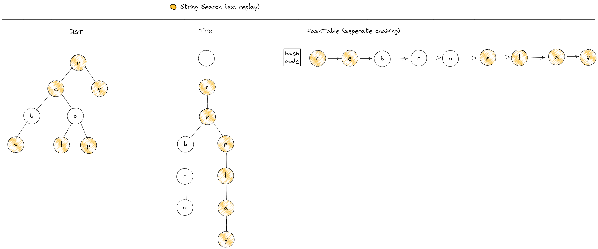

# 트라이

## 이론

 

트라이란

    문자열을 효과적으로 탐색하기 위한 자료구조이다.

장점은

    삽입/탐색에 BST와 해싱보다 빠르다.
    
BST와 비교해보면, 

    - 삽입은 BST에서 트리를 재정렬해야하고

    - 탐색은 문자열의 문자가 leaf node에 있으면서, height가 문자열의 길이보다 높을 시

      문자하나를 찾는데도 O(n)이 걸릴 수 있기 때문에

      매번 hit하는 트라이보다 느릴 수 있다.
    
해싱과 비교하면

    - 삽입은 충돌된 해시키의 연결리스트 노드만큼 이동해야하고,
    
    - 탐색은 문자열의 문자가 p, l, a, y와 같이 연결리스트 뒤에 포진되있을 경우

      트라이보다 느릴 수 있다.

단점은
    
    많은 노드 포인터로 많은 메모리가 필요하다.

## 구현

208. Implement Trie (Prefix Tree)
  <a href="https://leetcode.com/problems/implement-trie-prefix-tree/">👊</a>

    ...

> [`ADT/yongki/Trie/Trie.js`](https://github.com/cs-study-org/algorithm-study/blob/master/ADT/yongki/Trie/Trie.js) 를 눌러 확인할 수 있다.
> [`test/trie.test.js`](https://github.com/cs-study-org/algorithm-study/blob/master/11/yongki/test/Trie.test.js)에서 테스트 해볼수 있다.

## 참고 문헌

[Advantages of Trie Data Structure](https://www.geeksforgeeks.org/advantages-trie-data-structure/) ━ *GeeksforGeeks*

[Time and Space complexity of Trie](https://iq.opengenus.org/time-complexity-of-trie/) ━ *OpenGenus*