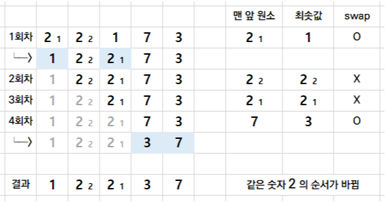

# 정렬

## 정렬 알고리즘이란
정렬 알고리즘은 n개의 숫자가 입력으로 주어졌을 때, 이를 사용작다 지정한 기준에 맞게 정렬하여 출력하는 알고리즘이다.

예를 들어 n개의 숫자가 저장되어있는 배열을, 오름차순의 조건으로 작성하여 입력하면 오름차순으로 정렬된 배열을 출력으로 구할수 있다.

정렬 알고리즘은 정말 다양하고, 이에 따라 각각의 수행시간도 차이가 크다.


## 정렬 알고리즘 선택 기준
1. 정렬할 데이터의 양
2. 데이터와 메모리
3. 이미 정렬된 정도
4. 필요한 추가 메모리의 양
5. 상대위치 보존여부

따라서 여러 정렬 알고리즘 중 알맞은 알고리즘을 사용해야 한다.

## 버블 정렬(Bubble Sort)
> 인접한 두 개의 원소를 비교해서 자리를 교환하는 방식

### 동작과정
1. 1회전에 첫 번째 원소와 두 번째 원소를, 두 번째 원소와 세번째 원소를... 이런식으로 (마지막-1)번째 원소와 마지막 원소를 비교하여 조건에 맞지 않는다면 서로를 교환한다.
2. `1번`이 수행되면 가장 큰 원소가 맨 뒤로 이동하므로 2회전에서는 맨 끝에 있는 원소는 제외하고, 2회전을 수행한다. 이렇게하면 (마지막-1)번째 원소가 정해진다.
3. 이 과정을 배열의 인덱스만큼 수행한다.


### 시공간복잡도
| 시간복잡도 | 공간복잡도 |
|---|---|
| O(n^2) | O(1) |

### 장단점
- 장점
  - 알고리즘이 단순하다.
  - 정렬하고자하는 배열안에서 교환하는 방식으로 다른 메모리 공간이 필요로 하지 않는다.=> **제자리 정렬(in-place-sorting)**
  - 안정 정렬(Stable Sort)이다.
- 단점
  - 시간복잡도가 크다.
  - 정렬을 하기 위한 교환연산이 많이 일어난다.

### 최적화
```text
Initial: [1, 2, 3, 5, 4]

 Pass 1: [1, 2, 3, 4, 5] => Swap 있었음
                      *
 Pass 2: [1, 2, 3, 4, 5] => Swap 없었음
                   *  *
=> 이전 패스에서 swap이 한 번도 없었으니 종료
```

조건문을 통해 스왑이 없는 경우 회전을 나가서 시간복잡도를 줄일 수 있다.


## 선택 정렬(Selection Sort)
> 선택 정렬은 현재 위치에 들어갈 값을 찾아 정렬하는 배열이다.

### 동작 과정
1. 정렬되지 않은 인덱스의 맨 앞에서부터, 이를 포함한 그 이후의 배열값 중 `최솟값`을 찾는다.
2. 최솟값을 찾으면, 그 값을 현재 인덱스의 값과 바꾼다.
3. 인덱스를 하나 뒤로 미루고, 위에 `1번`과 `2번`을 배열이 끝날 때까지 반복한다.




### 시공간복잡도
| 시간복잡도 | 공간복잡도 |
|---|---|
| O(n^2) | O(1) |

### 장단점
- 장점
  - 알고리즘이 단순하다.
  - 정렬을 위한 비교 횟수는 많지만, 인덱스가 증가할수록 점점 비교 횟수가 줄어들어 버블정렬에 비해 효율적이다.
  - 정렬하고자하는 배열안에서 교환하는 방식으로 다른 메모리 공간이 필요로 하지 않는다.=> **제자리 정렬(in-place-sorting)**
- 단점
  - 시간복잡도가 크다.
  - **불안정 정렬(Unstable Sort)**이다.


## 삽입 정렬(Insertion Sort)
> 삽입 정렬은 현재 위치에서, 그 이하의 배열들을 비교하여 자신이 들어갈 위치를 찾아 그 위치에 삽입하는 알고리즘이다.

### 동작 과정
1. 삽입 정렬은 두 번째 인덱스부터 시작한다. 현재 인덱스는 별도의 변수에 저장해주고, 비교 인덱스를 현재 인덱스-1로 잡는다.
2. 별도로 저장해 둔 삽입을 위한 변수와, 비교 인덱스의 배열의 값을 비교한다.
3. 삽입 변수의 값이 더 작으면 현재 인덱스로 비교 인덱스의 값을 저장해주고, 비교 인덱스를 -1하여 비교를 반복한다.
4. 만약 삽입 변수가 더 크면, 비교 인덱스+1에 삽입 변수를 저장한다.


### 시공간복잡도
| 시간복잡도 | 공간복잡도 |
|---|---|
| O(n^2) | O(1) |

### 장단점
- 장점
  - 대부분의 원소가 이미 정렬되어 있는 경우, 최선의 시간복잡도가 O(n)으로 효율적이다.
  - 제자리 정렬이다.(다른 메모리 공간 사용 x)
  - 안정 정렬이다.
- 단점
  - 평균과 최악의 시간복잡도가 O(n^2)으로 비효율적
  - 비열이 길어질 수록 비효율적이다.


## 퀵 정렬(Quick Sort)
> **분할 정복 방법**을 통해 주어진 배열을 정렬한다.
- 분할 정렬 방법 : 문제를 2개의 작은 문제로 분리하고 각각을 해결한 다음, 결과를 모아서 원래의 문제를 해결하는 전략.

### 동작과정
1. pivot point로 잡을 배열의 값 하나를 정한다. 보통 맨 앞이나 맨 뒤, 혹은 전체 배열 값 중 중간값이나 랜덤 값으로 정한다.
2. 분할을 진행하기에 앞서, 비교를 진행하기 위해 가장 왼쪽 배열의 인덱스를 저장하는 left변수, 가장 오른쪽 배열의 인덱스를 저장한 right변수를 생성한다.
3. right부터 비교를 진행한다. 비교는 right가 left보다 클 때만 반복하며, 비교한 배열값이 pivot point보다 크면 right를 하나 감소시키고 비교를 반복한다.
pivot point보다 작은 배열 값을 찾으면, 반복을 중지한다.
4. 그 다음 left부터 비교를 진행한다. 비교는 right가 left보다 클 때만 반복하며, 비교한 배열값이 pivot point보다 작으면 left를 하나 증가시키고 비교를 반복한다.
pivot point보다 큰 배열 값을 찾으면, 반복을 중지한다.
5. left인덱스의 값과 rigft인덱스의 값을 바꿔준다.
6. 3,4,5 과정을 left < right가 만족할 때까지 반복한다.
7. 위 과정이 끝나면 left의 값과 pivot point를 바꿔준다.
8. 맨 왼쪽부터 left-1까지, left+1부터 맨 오른쪽까지는 나눠 퀵 정렬을 반복한다.


### 시공간복잡도
| 시간복잡도 | 공간복잡도 |
|---|---|
| O(n log n) | O(1) |

### 장단점
- 장점
  - 불필요한 데이터의 이동을 줄이고 먼 거리의 데이터를 교환할 뿐만 아니라, 한 번 결정된 피벗들이 추후 연산에서 제외되는 득성 때문에 시간복잡도가 O(n log n)으로 빠르다.
  - 제자리 정렬이다.(다른 메모리 공간 사용 x)
- 단점
  - 정렬된 배열에 대해서는 퀵정렬의 불균형 분할에 의해 시간복잡도가 증가한다.
  - 불안정 정렬이다.