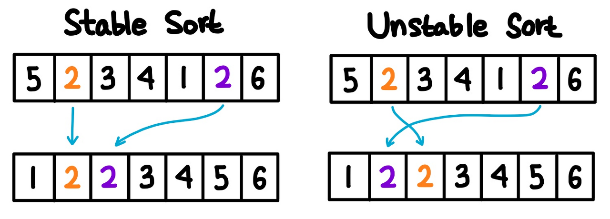
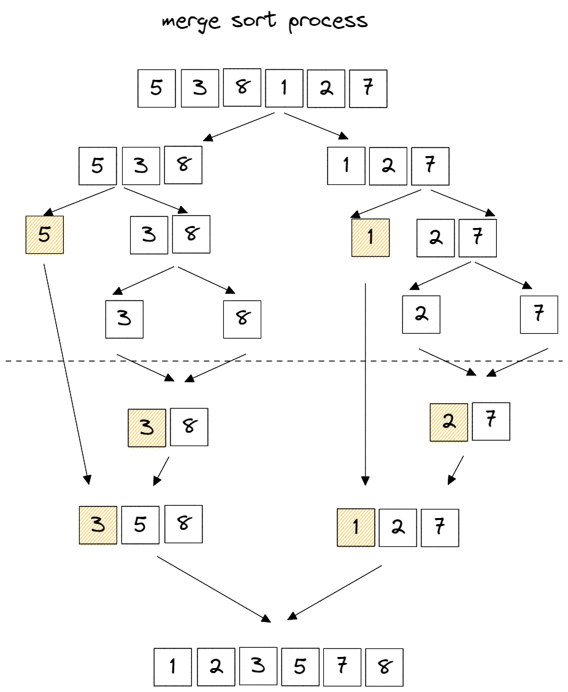
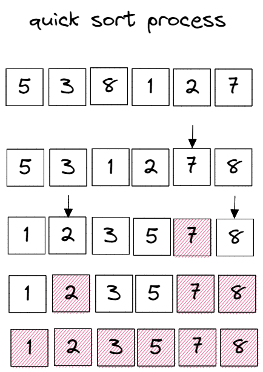
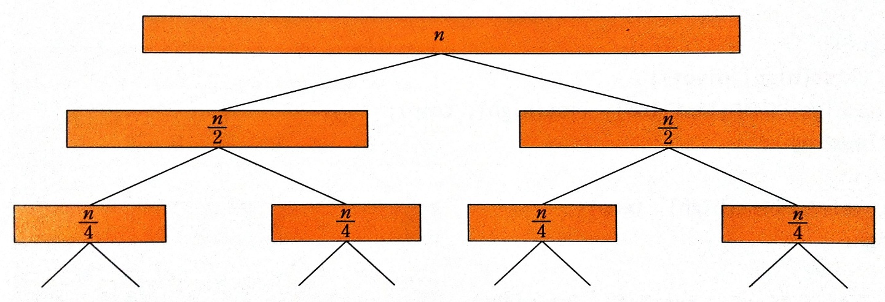
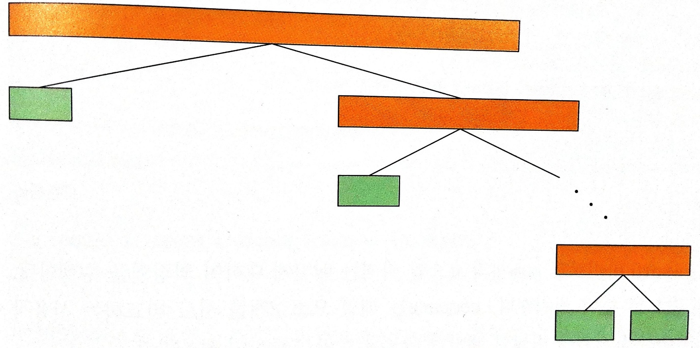

# 정렬

## 이론 및 구현

정렬 알고리즘을 평가하는 시간 복잡도는

    a. 비교 연산(swap)의 횟수와

    b. 이동 연산(move)의 횟수이다.

swap의 횟수와 move의 횟수는 서로 비례하지 않는다.

    비교 연산의 횟수는 > 이동 연산의 횟수
    
    그 반대도 가능하다.

### 안정 vs 불안정

안정 정렬은

    중복된 값을 입력 순서와 동일하게 정렬한다.

불안정 정렬은

    중복된 값을 입력 순서와 동일하지 않게 정렬한다.

in-place한 방법은

    추가 메모리 공간을 사용하지 않는다.

즉, 앞으로 기술할 정렬 알고리즘이 안정적이냐 in-place 하냐에 해당한다면 장점이 된다.

안정 정렬

 

빅오는 다음과 같다.

|       |  삽입   |  버블   |     병합     | 퀵 정렬(not in-place) |
| :---: | :-----: | :-----: | :----------: | :-------------------: |
| 최선  | `O(n)`  | `O(n)`  | `O(n log n)` |     `O(n log n)`      |
| 평균  | `O(n²)` | `O(n²)` | `O(n log n)` |     `O(n log n)`      |
| 최악  | `O(n²)` | `O(n²)` | `O(n log n)` |        `O(n²)`        |
| 공간  | `O(1)`  | `O(1)`  |    `O(n)`    |        `O(n)`         |

### 삽입 정렬

    왼쪽에서 오른쪽으로 가면서 각 요소들을 왼쪽 요소들과 비교하여 알맞은 자리에 삽입한다.

복잡도 분석

    최선(이미 정렬되어 있는 경우)에서는

        외부 루프에서       n - 1번의 swap
        내부 루프에서           1번의 swap, 2번의 move

    최악(역순의 경우)에서는
    외부 루프의 횟수를 i라고 하였을때

        외부 루프에서       n - 1번의 swap
        내부 루프에서           i번의 swap

장점은

    최선의 경우 가장 빠른 알고리즘에 속한다.

단점은

    정렬이 되어있지 않는 경우이다.    
    
    즉, 데이터가 많을 수록 적합하지 않다.

### 버블 정렬

    인접한 데이터를 비교하여 크기가 큰 쪽을 오른쪽으로 교환한다.

특징으로는

    매 회전마다 맨 마지막 데이터의 위치가 정해진다.

장점은

    단순한 알고리즘

단점은

    하나의 요소가 오른쪽으로 이동하기 위해서는 리스트의 모든 다른 요소들과 교환되어야한다.

    특정 요소가 최종 정렬 위치에 있는 경우라도 교환이 발생할 수 있다.
    
    즉, swap 작업이 move 작업보다 복잡하기 때문에 데이터가 많을 수록 적합하지 않다.

### 병합 정렬

어떻게 분할하는가?

    1. 같은 크기의 2개의 리스트로 분할한다.

    2. 부분 리스트를 정렬한다. 부분 리스트가 충분히 작지 않다면 다시 분할한다.

    3. 정렬된 부분 리스트를 결합한다.

장점은

    복잡도가 데이터 분포에 영향을 받지 않아 안정적이다.

단점은

    - 임시 배열이 필요하다.
    
    - 데이터가 많을 수록 move연산이 많아진다. 

🤔 연결리스트로 극복

### 퀵 정렬 (not in-place)

장점은

    stable한 퀵 정렬이고,

단점은

    in place 하지 않은 퀵 정렬이다.

불안정 정렬

 

빅오는 다음과 같다.

|       |  선택   | 퀵(in-place) |      힙      |
| :---: | :-----: | :----------: | :----------: |
| 최선  | `O(n²)` | `O(n log n)` | `O(n log n)` |
| 평균  | `O(n²)` | `O(n log n)` | `O(n log n)` |
| 최악  | `O(n²)` |   `O(n²)`    | `O(n log n)` |
| 공간  | `O(1)`  |  `O(log n)`  |    `O(n)`    |

### 선택 정렬

**in-place 하지 않은 방법**

    1. 왼쪽 리스트에는 정렬이 완료된 요소들이, 오른쪽 리스트에는 정렬되지 않은 요소들이 들어 있다.

        초기 상태에 왼쪽 리스트는 비어 있다.

    2. 오른쪽 리스트에서 최소값을 선택하여 왼쪽 리스트로 이동하는 작업을 되풀이 한다.

**in-place한 방법**

    1. 리스트에서 최소값을 선택한 다음, 이 최소값을 리스트의 첫번째 요소와 교환한다.

    2. 첫번째 요소를 제외한 나머지 요소들 중에서 위 작업을 되풀이 한다.

특징으로는

    매 회전마다 n번째 데이터의 위치가 정해진다.

장점은

    in place 방법을 사용할 때이다.

단점은

    이미 정렬되어 있는 경우에도 매번 최소값을 찾는다.

### 퀵 정렬 (in-place)

어떻게 분할하는가?

    1. low와 high를 왼쪽과 오른쪽에서 출발시켜서 부적절한 데이터를 만나게 되면 교환하고 
    
        아니면 계속 진행하다가 서로 엇갈리게 되면 멈춰서 피봇을 중앙으로 이동시킨다.

    2. 그러면 피봇을 기준으로 2개의 리스트로 분할하게 된다.

    3. 각각의 부분 리스트를 다시 퀵정렬한다.

장점은

    한번 결정된 피벗들이 추후 연산에서 제외된다.

단점은

<table>
    <tr>
        <th>최선 시나리오</th>
        <th>최악 시나리오</th>
    </tr>
    <tr>
        <td>
            
        </td>
        <td>
            
        </td>
    </tr>
</table>

    불균형 분할에서 최악으로 발생하며

    이미 정렬된 경우나 역순을 재정렬하는 경우 발생한다.

    피벗을 랜덤으로 설정하는 랜덤화된 퀵소트로 극복한다.    

### 힙 정렬

> 지난 10주차 힙 주제의 [md 링크](https://github.com/cs-study-org/algorithm-study/tree/main/10/yongki/Heap.md)를 첨부한다.

## 참고 문헌

[정렬 알고리즘 시간 복잡도](https://velog.io/@good159897/안정-정렬-VS-불안정-정렬-파이썬-알고리즘-인터뷰) ━ *velog*

[퀵 정렬 특징](https://im-developer.tistory.com/135) ━ *tistory*

[퀵 정렬 구현](https://stackabuse.com/quicksort-in-javascript/) ━ *StackAbuse*

[퀵 정렬 공간복잡도](https://en.wikipedia.org/wiki/Quicksort) ━ *StackAbuse*

[버블/삽입/선택 정렬 특징](https://im-developer.tistory.com/133?category=846746) ━ *Wikipedia*

[퀵 정렬 vs 버블 정렬](https://www.interviewbit.com/tutorial/quicksort-algorithm/) ━ *InterviewBit*

[Merge sort a linked list](https://learnersbucket.com/examples/algorithms/merge-sort-a-linked-list/) ━ *LearnersBucket*