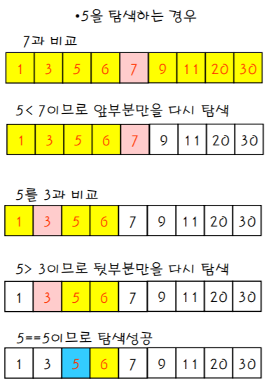

# 이진 탐색

## 이진 탐색이란?
이진 탐색 알고리즘은 **정렬**된 리스트 또는 배열에서 특정한 값의 위치를 찾는 알고리즘이다.

처음 중간의 값을 임의의 값으로 선택하여, 그 값과 찾고자 하는 값의 크고 작음을 비교하여 탐색의 범위를 반으로 줄이는 방식




## 이진 탐색의 주요 로직

1. low는 탐색해야하는 배열의 0번째 인덱스의 값이 들어가야 한다.
2. high에는 탐색해야하는 배열의 n-1번째 인덱스의 값이 들어가야 한다.
3. mid는 low와 high의 중간값 = (low + high) / 2 이다.
4. low <= high일때까지 반복한다.
   - mid의 값과 탐색해야하는 값(key)를 비교한다.
      1. key > mid : 구하고자 하는 값이 중간값 보다 높다면 low를 mid + 1로 변경
      2. key < mid : 구하고자 하는 값이 중간값 보다 작다면 high를 mid - 1로 변경
      3. key == mid : 구하고자하는 값 리턴


## 이진 탐색 코드

```java
int binarySearch2(int key, int low, int high) {
	int mid;

	while(low <= high) {
		mid = (low + high) / 2;

		if(key == arr[mid]) {
			return mid;
		} else if(key < arr[mid]) {
			high = mid - 1;
		} else {
			low = mid + 1;
		}
	}

	return -1; // 탐색 실패 
}
```
