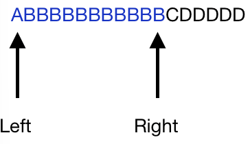
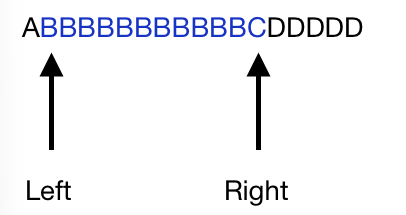

# 투 포인터 & 슬라이딩 윈도우

# 투 포인터

## 정의
투 포인터는 **연속되고 길이가 가변적인** 부분 배열들을 활용하여 특정 조건을 일치시키는 알고리즘이다.

## 유형
1. 2개의 포인터 변수 시작점이 배열의 시작점인 경우
2. 정렬된 배열 안에서 2개의 포인터 변수가 각각 시작점과 끝점인 경우


# 슬라이딩 윈도우

## 정의
슬라이딩 윈도우 알고리즘은 위도우 즉 일정한 범위를 가지고 있는 것을 유지하면서 이것을 이동 하는 것이다.

## 예시
2가지 긴 물자열이 주어지고 알파벳 2개만을 포함하는 가장 긴 문자열을 찾아보는 문제가 있다고 가정하자

이 문제를 슬라이딩 알고리즘을 이용하여 풀면 다음과 같이 파란색으로 칠해진 영역이 위도우가 되고 이를 하나씩 밀게 되는 것이다.



그림의 Riggt를 하나씩 움직이면 되는데 Right가 C를 가리키면 다음 포함하는 문자열이 3개가 되므로 윈도우가 더이상 확장되지 않고 다음 윈도우로 움직인다.



이런식으로 움직이게 된다. 마찬가지로 D로 움직이면 CD만 포함되게 된다.

Max lenght를 값으로 가지면서 윈도우를 옮길 수 있는데 윈도우의 범위를 어떻게 기억할 것인가가 관건이다.

대표적으로 Map을 활용한다.

<알파벳, index>로 각 위치를 기억해두면 빠르게 알파벳의 시작 위치를 기억할 수 있다.

Map의 size가 3이상이 되면 조건을 벗어나므로 가장 작은 인덱스를 제거하고 새로운 인덱스를 Map에 넣으면 된다.

> 코드
 ```java
public int function(String s) {
    int n = s.length();
    if (n < 3) return n;
    int lIdx = 0;
    int rIdx = 0;
    Map<Character, Integer> hashMap = new HashMap<>();
    int maxx = 2;
    while (rIdx < n) {
        if (hashMap.size() < 3)
            hashMap.put(s.charAt(rIdx), rIdx++);
        if (hashMap.size() == 3) {
            int minIdx = Collections.min(hashMap.values());
            hashMap.remove(s.charAt(minIdx));
            lIdx = minIdx + 1;
        }
        maxx = Math.max(maxx, rIdx - lIdx);
    }
    return maxx;
}
``` 

# 투포인터와 슬라이딩 윈도우의 차이
**부분 배열 길이의 변화 여부**

즉, 투 포인터 알고리즘은 부분 배열의 길이가 가변적이지만 슬라이딩 윈도우 알고리즘은 부분 배열의 길이가 고정적이다.


## 참고 문헌
[참고문헌1](https://ramees.tistory.com/52)

[참고문헌2](https://hanyeop.tistory.com/356)

