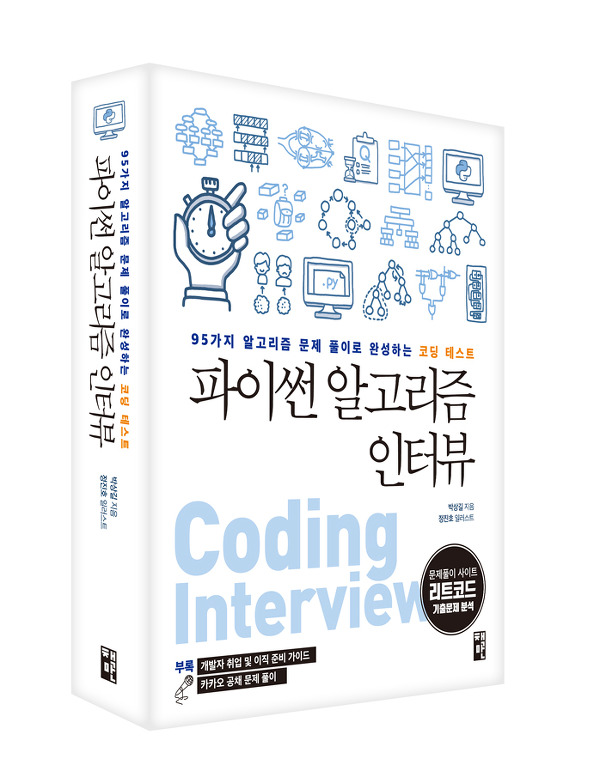

# Algorithm Study

코딩 테스트 준비를 위한 ps 스터디 저장소입니다.

## 교재

<div align="center">
<a href="http://www.yes24.com/Product/Goods/91084402">
      
</a>
      
<a href="http://www.yes24.com/Product/Goods/44305533">
      
</a>
</div>

## 주차별 주제

<div align="center">
<table>
      <tr>
            <th colspan="4">공통</th>
      </tr>
      <tr>
            <td>
                  <a href="https://github.com/cs-study-org/algorithm-study/tree/main/00">0th</a>
            </td>
            <td colspan="3">빅오</td>
      </tr>
      <tr>
            <th colspan="2">자료구조</th>
            <th colspan="2">알고리즘</th>
      </tr>
      <tr>
            <td>
                  <a href="https://github.com/cs-study-org/algorithm-study/tree/main/01">1st</a>
            </td>
            <td>문자열 조작</td>
            <td>
                  <a href="https://github.com/cs-study-org/algorithm-study/tree/main/12">12th</a>
            </td>
            <td>정렬</td>
      </tr>
      <tr>
            <td>
                  <a href="https://github.com/cs-study-org/algorithm-study/tree/main/02">2nd</a>
            </td>
            <td>배열</td>
            <td>
                  <a href="https://github.com/cs-study-org/algorithm-study/tree/main/13">13th</a>
            </td>
            <td>이진 탐색</td>
      </tr>
      <tr>
            <td>
                  <a href="https://github.com/cs-study-org/algorithm-study/tree/main/03">3rd</a>
            </td>
            <td>연결리스트</td>
            <td>
                  <a href="https://github.com/cs-study-org/algorithm-study/tree/main/14">14th</a>
            </td>
            <td>비트 조작</td>
      </tr>
      <tr>
            <td>
                  <a href="https://github.com/cs-study-org/algorithm-study/tree/main/04">4th</a>
            </td>
            <td>스택, 큐</td>
            <td>
                  <a href="https://github.com/cs-study-org/algorithm-study/tree/main/15">15th</a>
            </td>
            <td>슬라이딩 윈도우</td>
      </tr>
      <tr>
            <td>
                  <a href="https://github.com/cs-study-org/algorithm-study/tree/main/05">5th</a>
            </td>
            <td>데크, 우선순위 큐</td>
            <td>
                  <a href="https://github.com/cs-study-org/algorithm-study/tree/main/16">16th</a>
            </td>
            <td>그리디</td>
      </tr>
      <tr>
            <td>
                  <a href="https://github.com/cs-study-org/algorithm-study/tree/main/06">6th</a>
            </td>
            <td>해시 테이블</td>
            <td align="center" rowspan="6" colspan="2">-</td>   
      </tr>
      <tr>
            <td>
                  <a href="https://github.com/cs-study-org/algorithm-study/tree/main/07">7th</a>
            </td>
            <td>그래프</td>            
      </tr>
      <tr>
            <td>
                  <a href="https://github.com/cs-study-org/algorithm-study/tree/main/08">8th</a>
            </td>
            <td>최단 경로</td>
      </tr>
      <tr>
            <td>
                  <a href="https://github.com/cs-study-org/algorithm-study/tree/main/09">9th</a>
            </td>
            <td>트리</td>            
      </tr>      
      <tr>            
            <td>
                  <a href="https://github.com/cs-study-org/algorithm-study/tree/main/10">10th</a>
            </td>
            <td>힙</td>                       
      </tr>
      <tr>            
            <td>
                  <a href="https://github.com/cs-study-org/algorithm-study/tree/main/11">11th</a>
            </td>
            <td>트라이</td>            
      </tr>
</table>      
</div>

## 규칙
1. 스터디원들은 PR이 올라오면, 실시간으로 피드백 답글을 남긴다.
2. 주제에 맞는 알고리즘 문제를 발표자료로 준비한다.
3. 스터디 소요시간은 스터디(`4일`) + 리뷰(`2일`) + 발표(`일주일이되는 금일 또는 익일`)이다.
4. `merge` 하려면, 본인 PR 리뷰어들의 `approve`를 모두 얻은 뒤 본인이 한다.       
      4-1. `approve`할 시, PR 리뷰어들은 PR 당사자가 아래 항목을 맞췄는지 최종 확인한다.
      ```
      Q. 다른 스터디원의 파일이 PR 당사자의 파일에 포함되었는가? 
      A. 있다면 제거하는 커밋 올려야하므로 비승인

      Q. 리뷰어들의 피드백을 해결해주었나? 
      A. 해결되지 않았다면 비승인

      Q. 파일에 오탈자나 마크다운 일관성을 해치는 부분이 있나? 
      A. 있다면 비승인
      ```
      4-2. 최종확인 끝난다면, PR에 `approve`를 남긴다.
      ```
      1. PR > files changed에서 review changes 버튼을 누른다.
      2. approve 라디오버튼을 체크한 뒤, submit review 버튼을 누른다.
      3. 다음 사진과 같은 코맨트가 달렸다면 성공이다.
      ```
            
      

## [제출방법](https://github.com/cs-study-org/cs-study/wiki/제출방법)

링크를 확인해주세요.
